

  

# **Universidad Peruana de Ciencias Aplicadas**
## Carrera de Ingeniería de Software

Ciclo: 2024 - 1

Curso: Desarrollo de Aplicaciones Open Source

Sección: WX52

Profesor: Elio Jefferrson Navarrete Vilca

“Informe de Trabajo Final"

Startup: AgroTech

Producto: AgroConnect

Grupo: 1

|          Integrantes          |      Código      |
|:-----------------------------:|:-------------------:|
|   Delgado Corrales, Piero Gonzalo   |    U202210749    |
|  Lucas Coronel, Nadia Alessandra   |    U202120430    |
|   Paredes Puente, Sebastián Roberto  |    U202217239    |
|  Salinas Torres, Salvador Antonio   |    U20221B127    |
|   Valverde Mozo, Andre Gabriel   |    U202218899    |

Abril 2024

<table>
  <thead>
    <tr>
        <th>Versión</th>
        <th>Fecha</th>
        <th>Autor</th>
        <th>Descripción de modificación</th>
    </tr>
  </thead>
  <tbody>
  <tr>
      <td><strong>TB1</strong></td>
      <td>Sábado 13 de Abril</td>
      <td>
        <ul>
          <li>Delgado Corrales, Piero Gonzalo</li>
          <li>Lucas Coronel, Nadia Alessandra</li>
          <li>Paredes Puente, Sebastián Roberto</li>
          <li>Salinas Torres, Salvador Antonio</li>
          <li>Valverde Mozo, Andre Gabriel</li>
        </ul>
      </td>
      <td>
        Se han incluído los siguientes capítulos:
        <ul>
          <li>Capítulo I: Introducción</li>
          <li>Capítulo II: Requirements Elicitation & Analysis</li>
          <li>Capítulo III: Requirements Specification</li>
          <li>Capítulo IV: Product Design</li>
          <li>Avance del Capítulo V: Product Implementation, Validation & Deployment hasta el punto 5.2.1.8</li>
          <li>Avance de Conclusiones, Bibliografía y Anexos</li>
        </ul>
      </td>
  </tr>
  </tbody>
</table>

# **Project Report Collaboration Insights**
URL Project Report (Github): https://github.com/AgroTech-UPC/Project-Report

# **Tabla de Contenido**

- [Registro de Versiones](#registro-de-versiones)
- [Student Outcome](#student-outcome)
- [Capítulo I: Introducción](#Capítulo-I-Introducción)
  - [1.1. Startup Profile](#11-startup-profile)
    - [1.1.1. Descripción de la Startup](#111-descripción-de-la-startup)
    - [1.1.2. Perfiles de integrantes del equipo](#112-perfiles-de-integrantes-del-equipo)
  - [1.2. Solution Profile](#12-solution-profile)
    - [1.2.1. Antecedentes y problemática](#121-antecedentes-y-problemática)
    - [1.2.2. Lean UX Process](#122-lean-ux-process)
      - [1.2.2.1. Lean UX Problem Statements](#1221-lean-ux-problem-statements)
      - [1.2.2.2. Lean UX Assumptions](#1222-lean-ux-assumptions)
      - [1.2.2.3. Lean UX Hypothesis Statements](#1223-lean-ux-hypothesis-statements)
      - [1.2.2.4. Lean UX Canvas](#1224-lean-ux-canvas)
  - [1.3. Segmentos objetivo](#13-segmentos-objetivo)
- [Capítulo II: Requirements Elicitation & Analysis](#Capítulo-II-Requirements-Elicitation--Analysis)
  - [2.1. Competidores](#21-competidores)
    - [2.1.1. Análisis competitivo](#211-análisis-competitivo)
    - [2.1.2. Estrategias y tácticas frente a competidores](#212-estrategias-y-tácticas-frente-a-competidores)
  - [2.2. Entrevistas](#22-entrevistas)
    - [2.2.1. Diseño de entrevistas](#221-diseño-de-entrevistas)
    - [2.2.2. Registro de entrevistas](#222-registro-de-entrevistas)
    - [2.2.3. Análisis de entrevistas](#223-análisis-de-entrevistas)
  - [2.3. Needfinding](#23-needfinding)
    - [2.3.1. User Personas](#231-user-personas)
    - [2.3.2. User Task Matrix](#232-user-task-matrix)
    - [2.3.3. User Journey Mapping](#233-user-journey-mapping)
    - [2.3.4. Empathy Mapping](#234-empathy-mapping)
    - [2.3.5. As-is Scenario Mapping](#235-as-is-scenario-mapping)
  - [2.4. Ubiquitous Language](#24-ubiquitous-language)
- [Capítulo III: Requirements Specification](#Capítulo-III-Requirements-Specification)
  - [3.1. To-Be Scenario Mapping](#31-to-be-scenario-mapping)
  - [3.2. User Stories](#32-user-stories)
  - [3.3. Impact Mapping](#33-impact-mapping)
  - [3.4. Product Backlog](#34-product-backlog)
- [Capítulo IV: Product Design](#Capítulo-IV-Product-Design)
  - [4.1. Style Guidelines](#41-style-guidelines)
    - [4.1.1. General Style Guidelines](#411-general-style-guidelines)
    - [4.1.2. Web Style Guidelines](#412-web-style-guidelines)
  - [4.2. Information Architecture](#42-information-architecture)
    - [4.2.1. Organization Systems](#421-organization-systems)
    - [4.2.2. Labeling Systems](#422-labeling-systems)
    - [4.2.3. SEO Tags and Meta Tags](#423-seo-tags-and-meta-tags)
    - [4.2.4. Searching Systems](#424-searching-systems)
    - [4.2.5. Navigation Systems](#425-navigation-systems)
  - [4.3. Landing Page UI Design](#43-landing-page-ui-design)
    - [4.3.1. Landing Page Wireframe](#431-landing-page-wireframe)
    - [4.3.2. Landing Page Mock-up](#432-landing-page-mock-up)
  - [4.4. Web Applications UX/UI Design](#44-web-applications-uxui-design)
    - [4.4.1. Web Applications Wireframes](#441-web-applications-wireframes)
    - [4.4.2. Web Applications Wireflow Diagrams](#442-web-applications-wireflow-diagrams)
    - [4.4.3. Web Applications Mock-ups](#443-web-applications-mock-ups)
    - [4.4.4. Web Applications User Flow Diagrams](#444-web-applications-user-flow-diagrams)
  - [4.5. Web Applications Prototyping](#45-web-applications-prototyping)
  - [4.6. Domain-Driven Software Architecture](#46-domain-driven-software-architecture)
    - [4.6.1. Software Architecture Context Diagram](#461-software-architecture-context-diagram)
    - [4.6.2. Software Architecture Container Diagrams](#462-software-architecture-container-diagrams)
    - [4.6.3. Software Architecture Components Diagrams](#463-software-architecture-components-diagrams)
  - [4.7. Software Object-Oriented Design](#47-software-object-oriented-design)
    - [4.7.1. Class Diagrams](#471-class-diagrams)
    - [4.7.2. Class Dictionary](#472-class-dictionary)
  - [4.8. Database Design](#48-database-design)
    - [4.8.1. Database Diagram](#481-database-diagram)
- [Capítulo V: Product Implementation, Validation & Deployment](#Capítulo-V-Product-Implementation-Validation--Deployment)
  - [5.1. Software Configuration Management](#51-software-configuration-management)
    - [5.1.1. Software Development Environment Configuration](#511-software-development-environment-configuration)
    - [5.1.2. Source Code Management](#512-source-code-management)
    - [5.1.3. Source Code Style Guide & Conventions](#513-source-code-style-guide--conventions)
    - [5.1.4. Software Deployment Configuration](#514-software-deployment-configuration)
  - [5.2. Landing Page, Services & Applications Implementation](#52-landing-page-services--applications-implementation)
    - [5.2.1. Sprint 1](#521-sprint-1)
      - [5.2.1.1. Sprint Planning 1](#5211-sprint-planning-1)
      - [5.2.1.2. Sprint Backlog 1](#5212-sprint-backlog-1)
      - [5.2.1.3. Development Evidence for Sprint Review](#5213-development-evidence-for-sprint-review)
      - [5.2.1.4. Testing Suite Evidence for Sprint Review](#5214-testing-suite-evidence-for-sprint-review)
      - [5.2.1.5. Execution Evidence for Sprint Review](#5215-execution-evidence-for-sprint-review)
      - [5.2.1.6. Services Documentation Evidence for Sprint Review](#5216-services-documentation-evidence-for-sprint-review)
      - [5.2.1.7. Software Deployment Evidence for Sprint Review](#5217-software-deployment-evidence-for-sprint-review)
      - [5.2.1.8. Team Collaboration Insights during Sprint](#5218-team-collaboration-insights-during-sprint)
  - [5.3. Validation Interviews](#53-validation-interviews)
    - [5.3.1. Diseño de Entrevistas](#531-diseño-de-entrevistas)
    - [5.3.2. Registro de Entrevistas](#532-registro-de-entrevistas)
    - [5.3.3. Evaluaciones según heurísticas](#533-evaluaciones-según-heurísticas)
  - [5.4. Video About-the-Product](#54-video-about-the-product)
- [Conclusiones](#conclusiones)
  - [Conclusiones y recomendaciones](#conclusiones-y-recomendaciones)
- [Video About-the-Team](#video-about-the-team)
- [Bibliografía](#bibliografía)
- [Anexos](#anexos)

**Student Outcome**

ABET – EAC - Student Outcome 3

Criterio: Capacidad de comunicarse efectivamente con un rango de audiencias

|**Criterio específico**|**Acciones realizadas**|**Conclusiones**|
| :- | :- | :- |
|Comunica oralmente sus ideas y/o resultados con objetividad a público de diferentes especialidades y niveles jerárquicos, en el marco del desarrollo de un proyecto en ingeniería.|
**Delgado Corrales, Piero Gonzalo**

**TB1:**

**Lucas Coronel, Nadia Alessandra**

**TB1:**

**Paredes Puente, Sebastián Roberto**

**TB1:**

**Salinas Torres, Salvador Antonio**

**TB1:**

**Valverde Mozo, Andre Gabriel**

**TB1:**
|**TB1:**|
|Comunica en forma escrita ideas y/o resultados con objetividad a público de diferentes especialidades y niveles jerárquicos, en el marco del desarrollo de un proyecto en ingeniería.|
**Delgado Corrales, Piero Gonzalo**

**TB1:**

**Lucas Coronel, Nadia Alessandra**

**TB1:**

**Paredes Puente, Sebastián Roberto**

**TB1:**

**Salinas Torres, Salvador Antonio**

**TB1:**

**Valverde Mozo, Andre Gabriel**

**TB1:**
|**TB1:**|

# Capítulo I: Introducción

## 1.1. Startup Profile

### 1.1.1. Descripción de la Startup

En AgroTech, nos especializamos en abordar los desafíos de la crianza de cuyes a través de nuestra aplicación integral AgroConnect. Nuestro enfoque principal es proporcionar asesoramiento especializado y herramientas tecnológicas para mejorar la gestión de granjas de cuyes de manera inteligente y eficiente.

**Misión:**

Empoderar a los granjeros a través de soluciones tecnológicas de vanguardia para una gestión más eficiente de sus criaderos.

**Visión:**

Liderar la innovación tecnológica en la gestión de la crianza de cuyes, promoviendo el bienestar animal y la sostenibilidad en esta industria específica, con miras a expandirnos hacia otros tipos de animales en el futuro.

  

_Imagen 1. Logo de la aplicación AgroConnect_

### 1.1.2. Perfiles de integrantes del equipo

<table>
  <tr>
    <th colspan="1" rowspan="2">
      
    </th>
    <td colspan="1" rowspan="2" valign="top">
      
<b>Delgado Corrales, Piero Gonzalo</b>

      

        Actualmente estoy en el quinto ciclo de Ingeniería de Software. Poseo destrezas en programación en C++, así como conocimientos en estructuras de datos y sus aplicaciones. Recientemente, he adquirido habilidades en diseño web utilizando HTML, CSS y herramientas como Figma. Soy una persona responsable y me esfuerzo por mantener una organización óptima para gestionar eficazmente las entregas de trabajos.
      

    </td>
  </tr>
</table>

<table>
  <tr>
    <th colspan="1" rowspan="2">
      
    </th>
    <td colspan="1" rowspan="2" valign="top">
      
<b>Salinas Torres, Salvador Antonio</b>

      

        Soy estudiante de quinto ciclo de la carrera de Ingeniería de Software. Poseo conocimientos en programación orientada a objetos en C++ y Python, desarrollo web usando HTML, CSS y JavaScript, y gestión de base de datos en SQL Server. Considero que soy una persona responsable y siempre organizo el tiempo para hacerlos tranquilamente antes de la fecha de entrega.
      

    </td>
  </tr>
</table>

<table>
  <tr>
    <th colspan="1" rowspan="2">
      
    </th>
    <td colspan="1" rowspan="2" valign="top">
      
<b>Lucas Coronel, Nadia Alessandra</b>

      

        Mi nombre es Nadia Alessandra Lucas Coronel y soy estudiante del sexto ciclo de la carrera de Ingeniería de Software. Me considero una persona entusiasta, perseverante y responsable. Cuento con conocimientos en SQL, C++, Python, HTML, CSS, JavaScript y metodologías ágiles. Me comprometo a aplicar mis conocimientos de manera efectiva para contribuir al desarrollo de soluciones de software de alta calidad.
      

    </td>
  </tr>
</table>

<table>
  <tr>
    <th colspan="1" rowspan="2">
      
    </th>
    <td colspan="1" rowspan="2" valign="top">
      
<b>Paredes Puente, Sebastian Roberto</b>

      

        Soy estudiante de quinto ciclo de la carrera de Ingeniería de Software. Dentro de mi experiencia, destaco la capacidad de analizar información y programar en lenguaje C + +. Además, he completado cursos en Python, SQL Server y HTML. En cuanto a mis habilidades interpersonales, cuento con adaptabilidad, pensamiento creativo, trabajo en equipo, gestión del tiempo y capacidad analítica para resolver problemas.
      

    </td>
  </tr>
</table>

<table>
  <tr>
    <th colspan="1" rowspan="2">
      
    </th>
    <td colspan="1" rowspan="2" valign="top">
      
<b>Valverde Mozo, Andre Gabriel</b>

      

        Mi perfil se basa en ser alguien que busca soluciones creativas a todo problema, todo es posible al fin y al cabo. Considero que tengo una buena capacidad de análisis de problemas y un pensamiento rápido en dichos casos. Me encanta todo lo que es la programación ya que es una forma de arte para mi, solo que lo puedo hacer realidad frente a mis ojos.
      

    </td>
  </tr>
</table>

## 1.2. Solution Profile

### 1.2.1 Antecedentes y problemática

- **What:** El sector de la crianza de cuyes enfrenta desafíos en la gestión eficiente de las granjas, la falta de acceso a tecnologías adecuadas y la necesidad de mejorar el bienestar animal y la sostenibilidad de las prácticas agrícolas. 
- **Where:** Nos enfocaremos en todo el territorio nacional del Perú, especialmente en los departamentos donde se concentra la mayor parte del comercio y la actividad económica del país, y donde la crianza de cuyes es más prevalente

- **When:** Actualmente, el sector agropecuario se enfrenta a estos desafíos en la gestión de la crianza de cuyes. Con el crecimiento de la población en el país y la demanda de alimentos en aumento, se requiere una mayor eficiencia en la producción agrícola. Además, las preocupaciones ambientales y de bienestar animal están impulsando la necesidad de adoptar prácticas agrícolas más sostenibles y éticas.
- **Who:** AgroTech, como empresa líder en tecnología aplicada a la agricultura, asume la responsabilidad de liderar la innovación en la gestión de la crianza de cuyes. En este proceso, trabajamos en estrecha colaboración con expertos y asesores en la crianza de cuyes, quienes aportan su conocimiento especializado para desarrollar soluciones tecnológicas específicas y efectivas. Además, involucramos activamente a los criadores de cuyes, quienes son los beneficiarios directos de estas soluciones, asegurando que se adapten a sus necesidades y realidades específicas.
- **Why:** Para abordar estos desafíos y mejorar la gestión y productividad en la crianza de cuyes, garantizando el bienestar animal y promoviendo prácticas sostenibles en la industria agropecuaria. Además, se busca mejorar la rentabilidad de los agricultores y contribuir a la seguridad alimentaria peruana.
- **How:** A través de la aplicación integral Agroconnect, que proporcionará asesoramiento especializado y herramientas tecnológicas para gestionar de manera inteligente y eficiente las granjas de cuyes. Esto incluirá sistemas de análisis predictivo para optimizar la alimentación y la salud de los animales, y la implementación de prácticas agrícolas más sostenibles.
- **How much:** Se espera que la aplicación tenga un impacto significativo en la mejora de la gestión de las granjas de cuyes, aumentando la productividad, mejorando el bienestar animal y promoviendo prácticas más sostenibles en la industria agropecuaria. Esta innovación busca mejorar la eficiencia en la crianza de los cuyes para de esta manera poder sumar a los esfuerzos del Ministerio de Desarrollo Agrario y Riego (Midagri) en este ámbito, el cuál ha informado que se logró un incremento del 20% en las crianzas de cuyes, lo que ha permitido un mayor consumo de carne de esta especie, evidenciando el impacto positivo de las tecnologías y prácticas innovadoras en la crianza de cuyes.
  Del mismo modo, hemos comprobado la necesidad del mercado gracias a las estadísticas brindadas por el Ministerio de Desarrollo Agrario y Riego (2023) ya que estas muestran que del año 2020 al 2021 hubo un aumento de 116 mil cuyes. Por lo que, se espera que siga aumentando. (Revisar [Anexo N°1: Gráfico de evolución de población de cuyes](#anexo-n°1-gráfico-de-evolución-de-población-de-cuyes)).  Entonces, nuestra aplicación ayudará para  mejorar el cuidado de los cuyes, ya que suelen haber problemas como la mala nutrición o el déficit de control de enfermedades que perjudica directamente a las granjas. (Revisar [Anexo N°2: Diagrama de problemas en la crianza de cuyes](#anexo-n°2-diagrama-de-problemas-en-la-crianza-de-cuyes))

### 1.2.2 Lean UX Process.

#### 1.2.2.1. Lean UX Problem Statements.

***Problem Statement 1***

|Nuestro producto tiene como objetivo mejorar la gestión de granjas de cuyes en el departamento de Lima.|
| - |
|Hemos observado que los criadores de cuyes en Lima enfrentan dificultades para gestionar eficientemente sus granjas, lo que afecta su productividad y rentabilidad.|
|¿Podría nuestra aplicación AgroConnect ayudar a los criadores de cuyes en Lima a mejorar la gestión de sus granjas y aumentar su productividad?|

***Problem Statement 2***

|Nuestro producto tiene como objetivo aumentar la rentabilidad de los criadores de cuyes en Lima.|
| - |
|Hemos observado que muchos criadores de cuyes en Lima enfrentan desafíos para lograr una rentabilidad adecuada debido a la falta de eficiencia en la gestión de sus granjas.|
|¿Podría Agroconnect ayudar a los criadores de cuyes en Lima a mejorar su rentabilidad mediante una gestión más eficiente de sus granjas?|

***Problem Statement 3***

|Nuestro producto tiene como objetivo facilitar el acceso a mercados y mejorar la comercialización de los productos de cuy en Lima.|
| - |
|Hemos observado que muchos criadores de cuyes en Lima enfrentan dificultades para acceder a mercados y comercializar sus productos de manera efectiva.|
|¿Podría Agroconnect ayudar a los criadores de cuyes en Lima a acceder a mercados y mejorar la comercialización de sus productos?|

#### 1.2.2.2. Lean UX Assumptions.

1. **¿Quién es el usuario?** 

   El usuario principal de nuestro producto es el criador de cuyes en el departamento de Lima. También pueden incluirse otros actores involucrados en la cadena de producción y comercialización de productos cárnicos de cuy, como los trabajadores de las granjas, los compradores de cuyes y los consumidores finales.

1. **¿Dónde encaja nuestro producto en su trabajo o vida?**

   Nuestro producto encaja en la vida del criador de cuyes al proporcionarle herramientas tecnológicas y asesoramiento especializado para mejorar la gestión de sus granjas. Agroconnect se integra en su trabajo diario al ofrecer soluciones para la gestión eficiente de la crianza de cuyes, la mejora del bienestar animal, la adopción de prácticas sostenibles y la comercialización de sus productos.

1. **¿Qué problemas tiene nuestro producto? ¿Resolver?**

   Actualmente, nuestro producto presenta un inconveniente, ya que no está configurado para enfocarse en la crianza de animales distintos al cuy. Por otra parte, aborda varios problemas que enfrentan los criadores de cuyes en Lima, como la falta de acceso a tecnologías adecuadas, la gestión ineficiente de las granjas, la necesidad de mejorar el bienestar animal, la baja rentabilidad y el impacto ambiental negativo de las prácticas agrícolas. Agroconnect resuelve estos problemas al proporcionar herramientas y conocimientos para una gestión más eficiente, prácticas agrícolas sostenibles, mejoramiento del bienestar animal, aumento de la rentabilidad y reducción del impacto ambiental.

1. **¿Cuándo y cómo es nuestro producto? ¿Usado?** 

   Nuestro producto sería utilizado de manera continua por los criadores de cuyes en Lima, como una herramienta integral en la gestión diaria de sus granjas. Agroconnect se utilizará a través de dispositivos móviles o computadoras, con acceso a internet, permitiendo a los usuarios utilizar la plataforma en cualquier momento y desde cualquier lugar.

1. **¿Qué características son importantes?**

   Asesoramiento especializado: Ofrecer información y recomendaciones específicas para la gestión de granjas de cuyes.

   Análisis predictivo: Proporcionar predicciones y sugerencias para optimizar la alimentación, la salud y la reproducción de los cuyes.

   Herramientas de gestión: Facilitar la administración de inventarios, registros de salud y reproducción, y planificación de actividades.

   Conexión con mercados: Ayudar a los criadores a acceder a mercados y promocionar sus productos nutricionales (la carne del cuy) de manera efectiva.

1. **¿Cómo debe verse nuestro producto y cómo comportarse?**

   Nuestro producto debe tener una interfaz intuitiva y fácil de usar, con un diseño limpio y atractivo. Debe comportarse de manera rápida y eficiente, brindando información y recomendaciones de manera clara y precisa. Debe ser confiable y seguro, garantizando la protección de los datos de los usuarios y la integridad de la información proporcionada.

**Presentación de otros supuestos:** 

|Creo que mis clientes necesitan un servicio que les brinde soluciones integrales para la gestión eficiente de la crianza de cuyes, abordando aspectos como la salud animal, la nutrición, la reproducción y la comercialización.|Haré dinero a través de la venta de suscripciones a nuestra plataforma Agroconnect, así como mediante la prestación de servicios de consultoría especializada y la venta de productos complementarios.|
| - | - |
|Estas necesidades se pueden resolver con tecnologías avanzadas de monitoreo y análisis de datos, junto con el acceso a un equipo de expertos en crianza de cuyes que proporcionen orientación y recomendaciones personalizadas.|
Mi competencia principal en el mercado será: BestFarm  

|
|Mis clientes iniciales son los criadores de cuyes en el departamento de Lima que buscan mejorar la eficiencia y la rentabilidad de sus operaciones.|Los venceremos gracias a nuestra combinación única de tecnología avanzada, conocimientos especializados y enfoque centrado en las necesidades específicas de la crianza de cuyes.|
|El valor número uno que un cliente quiere de mi servicio es mejorar la rentabilidad de su granja de cuyes mientras garantiza el bienestar de los animales y adoptar prácticas sostenibles.|Mi mayor riesgo con respecto al producto es la resistencia al cambio por parte de algunos criadores, que pueden ser reacios a adoptar nuevas tecnologías o modificar sus métodos de crianza.|
|El cliente también puede optar por no renovar su suscripción a nuestra plataforma si no percibe mejoras significativas en la gestión y rentabilidad de su granja de cuyes.|Resolveremos esto a través de una estrategia integral de educación y soporte continuo para nuestros clientes, demostrando el valor tangible de nuestra plataforma a través de casos de éxito y resultados demostrables.|
|Voy a adquirir a la mayoría de mis clientes a través de campañas de marketing dirigidas en línea, participación en eventos agrícolas locales y asociaciones con organizaciones de productores de cuyes.|Nuestro enfoque principal es proporcionar asesoramiento especializado y herramientas tecnológicas para mejorar la gestión de la crianza de cuyes de forma inteligente y eficiente.|

#### 1.2.2.3. Lean UX Hypothesis Statements.

**Hypothesis Statement 1**

|Creemos que al proporcionar a los criadores de cuyes en Lima acceso a tecnologías avanzadas y asesoramiento especializado a través de nuestra plataforma Agroconnect, mejorarán la eficiencia y la rentabilidad de sus granjas..|
| - |
|Sabremos que esto es cierto…|
|Cuando implementemos AgroConnect y realicemos un seguimiento de los resultados a lo largo del tiempo.|

**Hypothesis Statement 2**

|Creemos que al promover prácticas agrícolas sostenibles y éticas en la crianza de cuyes en Lima a través de Agroconnect, los criadores adoptarán un enfoque más responsable con el medio ambiente.|
| - |
|Sabremos que esto es cierto…|
|Cuando proporcionemos mediante los asesores, orientación y recursos específicos sobre prácticas sostenibles a través de Agroconnect y evaluemos la adopción de estas prácticas por parte de los criadores.|

**Hypothesis Statement 3**

|Creemos que al facilitar el acceso a mercados y mejorar la comercialización de los productos de cuy en Lima a través de Agroconnect, los criadores aumentarán sus ventas y expandirán sus negocios.|
| - |
|Sabremos que esto es cierto…|
|Cuando se establezcan conexiones con compradores y mercados a través de los asesores de Agroconnect y evaluemos el impacto en las ventas de los criadores que vendrían a ser los usuarios de la app.|

#### 1.2.2.4. Lean UX Canvas.

_Imagen 2. Lean UX Canvas_

## 1.3. Segmentos objetivo

Por el lado de los asesores, hemos considerado que estos tendrán experiencia en el campo y/o estudios universitarios en carreras como ingeniería agrónoma, medicina veterinaria, zootecnia, etc. De este modo, debido a que el plan de estudios de estas carreras es de mínimo 5 años a más, y necesitan cierto grado de experiencia para dar recomendaciones y planes de acción confiables, hemos decidido que el rango de edad será de 25 años hasta 65 años.

Según el Ministerio de Desarrollo Agrario y Riego (2023), la crianza de cuyes es una alternativa para la generación de ingresos monetarios para más de 800,000 familias agrarias en el Perú, las cuales se ubican en su mayoría en la sierra del país. El consumo de carne de cuy se ha mantenido en el tiempo e incluso ha trascendido al mercado externo. Esta información destaca la importancia de los asesores en la crianza de cuyes, ya que su conocimiento y orientación pueden ser fundamentales para el éxito y la sostenibilidad de los productores en este sector.

|**Segmento objetivo**|Asesores |
| :- | :- |
|**Edad**|25-65 años|
|**Ubicación**|Perú|
|**Sexo**|Masculino y Femenino|
|**Formación educativa**|Universitario o cualquier educación superior|
|**Poder adquisitivo**|Bajo, medio y alto|

Para delimitar el segmento objetivo de criadores de cuyes nos basamos en el diagnóstico situacional de la crianza de cuyes en Cajamarca realizado en julio de 2004. Dicho diagnóstico menciona que el 44.6% de los productores tenían más de 50 años, sus esposas que conducían la crianza de cuyes tenían entre 31 a 50 años. Además, los hijos que vivían con los padres tenían entre 6 a 17 años. Por lo tanto, para el rango de edad de los criadores decidimos seleccionar desde los 18 años de edad hasta los 60 años para abarcar tanto a los padres que manejan la crianza como a los hijos mayores de edad que la apoyan.

Por otro lado, el mismo diagnóstico señala que el grado de instrucción predominante en la familia es de educación primaría con un 65.6% que es el que consideraremos.

|**Segmento objetivo**|Criadores de cuyes|
| :- | :- |
|**Edad**|18-60 años|
|**Ubicación**|Perú|
|**Sexo**|Masculino y Femenino|
|**Formación educativa**|Educación primaria|
|**Poder adquisitivo**|Bajo y medio|

# Capítulo II Requirements Elicitation & Analysis

## 2.1. Competidores

### 2.1.1. Análisis competitivo
<table>
  <tr>
    <th colspan="6" valign="top">Competitive Analysis Landscape</th>
  </tr>
  <tr>
    <td colspan="2" valign="top">¿Por qué llevar a cabo este análisis?</td>
    <td colspan="4" valign="top">Objetivo 1: Adquirir conocimiento acerca de las propuestas ofrecidas por nuestros competidores y obtener enseñanzas a partir de las áreas en las que presentan limitaciones. 
    Objetivo 2: Identificar los puntos fuertes y las limitaciones de nuestros competidores con el fin de formular una estrategia competitiva sólida y efectiva.
    </td>
  </tr>
  <tr>
    <td colspan="2" rowspan="2" valign="top">Empresa/App</td>
    <td valign="top">AgroConnect </td>
    <td valign="top">BestFarm</td>
    <td valign="top">CattleMax</td>
    <td valign="top">BarnTools</td>
  </tr>
  <tr>
    <td valign="top"></td>
    <td valign="top">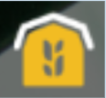</td>
    <td valign="top"></td>
    <td valign="top"></td>
  </tr>
  <tr>
    <td rowspan="2" valign="top">Perfil</td>
    <td valign="top">Overview</td>
    <td valign="top">Una aplicación integral desarrollada por AgroTech para mejorar la gestión de granjas de cuyes en el Perú. Ofrece asesoramiento especializado y herramientas tecnológicas para optimizar la alimentación, salud y sostenibilidad en la crianza de cuyes, empoderando a los granjeros a través de la innovación tecnológica.</td>
    <td valign="top">Plataforma integral de gestión agrícola que abarca una amplia gama de actividades agrícolas, incluyendo cultivos y ganadería.</td>
    <td valign="top">Aplicación especializada en la gestión de ganado. Está diseñada específicamente para ayudar a los ganaderos a llevar un registro detallado de su ganado, gestionar la salud y el seguimiento de la reproducción.</td>
    <td valign="top">BarnTools es una aplicación que se centra en la gestión de animales de granja en general, incluyendo ganado, aves de corral y otros animales. </td>
  </tr>
  <tr>
    <td valign="top">Ventaja competitiva ¿Qué valor ofrece a los clientes?</td>
    <td valign="top">La ventaja competitiva de AgroConnect es la integración completa de tecnología y asesoramiento especializado. Esto significa que no solo proporcionamos herramientas tecnológicas avanzadas a través de AgroConnect, sino que también ofrecemos orientación y asesoramiento específico para la crianza de cuyes.</td>
    <td valign="top">La ventaja competitiva de BestFarm radica en su enfoque de la gestión agrícola, que permite a los usuarios gestionar tanto cultivos como animales en una sola plataforma.</td>
    <td valign="top">La principal ventaja competitiva de CattleMax es que ofrece características y herramientas específicas para el ganado, lo que lo convierte en una opción sólida para ganaderos que buscan una solución dedicada.</td>
    <td valign="top">La ventaja competitiva de BarnTools radica en su capacidad para gestionar una variedad de animales de granja, lo que la hace adecuada para granjeros con múltiple variedad de ganado.</td>
  </tr>
  <tr>
    <td rowspan="2" valign="top">Perfil de Marketing</td>
    <td valign="top">Mercado objetivo</td>
    <td valign="top">El mercado objetivo de AgroConnect son los criadores de cuyes en Perú, así como otros actores involucrados en la cadena de producción y comercialización de productos cárnicos de cuy.</td>
    <td valign="top">El mercado objetivo de BestFarm incluye a agricultores y ganaderos que gestionan operaciones mixtas de cultivos y ganado.</td>
    <td valign="top">El mercado objetivo de CattleMax son los ganaderos y criadores de ganado de todas las escalas.</td>
    <td valign="top">El mercado objetivo de BarnTools son los granjeros y ganaderos que gestionan una variedad de animales</td>
  </tr>
  <tr>
    <td valign="top">Estrategias de marketing</td>
    <td valign="top">Campañas educativas en línea y fuera de línea para resaltar los beneficios de AgroConnet en términos de mejora de la productividad, bienestar animal y sostenibilidad en la crianza de cuyes.</td>
    <td valign="top">Promoción en ferias agrícolas y ganaderas para mostrar la versatilidad de la plataforma.</td>
    <td valign="top">Colaboración con asociaciones ganaderas y veterinarios especializados en ganado.</td>
    <td valign="top">Publicidad en revistas agrícolas y ganaderas</td>
  </tr>
  <tr>
    <td rowspan="3" valign="top">Perfil de Producto</td>
    <td valign="top">Productos & Servicios</td>
    <td valign="top">Plataforma integral de gestión para la crianza de cuyes. Ofreciendo una solución completa para la gestión eficiente de granjas de cuyes.</td>
    <td valign="top">Plataforma integral de gestión agrícola para cultivos y animales, planificación de cultivos, programación de tareas, seguimiento de salud, análisis de datos agrícolas</td>
    <td valign="top">Plataforma de gestión de ganado bovino, registro de animales, seguimiento de salud, programación de tareas, seguimiento de reproducción, gestión de gastos.</td>
    <td valign="top">Plataforma versátil para la gestión de animales de granja en general, registro de animales, seguimiento de salud, programación de tareas.</td>
  </tr>
  <tr>
    <td valign="top">Precios & Costos</td>
    <td valign="top">Modelo de suscripción mensual o anual. Los precios varían según la escala de la operación y las funcionalidades requeridas.</td>
    <td valign="top">BestFarm utiliza  precios basados en suscripción.</td>
    <td valign="top">CattleMax utiliza  precios basados en suscripción.</td>
    <td valign="top">BarnTools utiliza  precios basados en la suscripción.</td>
  </tr>
  <tr>
    <td valign="top">Canales de distribución (Web y/o Móvil)</td>
    <td valign="top">AgroConnect se distribuye principalmente a través de una plataforma web accesible desde cualquier navegador. También ofrece una aplicación móvil.</td>
    <td valign="top">BestFarm se distribuye a través de una plataforma web</td>
    <td valign="top">CattleMax se distribuye a través de una plataforma web y ofrece una aplicación móvil</td>
    <td valign="top">BarnTools se distribuye principalmente a través de una plataforma web accesible desde navegadores de computadoras de escritorio y dispositivos móviles.</td>
  </tr>
  <tr>
    <td rowspan="4" valign="top">Análisis SWOT</td>
    <td valign="top">Fortalezas</td>
    <td valign="top">- Integración completa de tecnología y asesoramiento especializado. 
    - Mejora del bienestar animal y la sostenibilidad en la crianza de cuyes. 
    - Plataforma integral que aborda múltiples aspectos de la gestión de granjas de cuyes. 
    - Potencial para expandirse hacia otros tipos de animales en el futuro.
    </td>
    <td valign="top">- Ofrece una plataforma integral para la gestión de cultivos y animales. 
    - Enfoque en la agricultura. 
    - Planificación y análisis de datos agrícolas.
    </td>
    <td valign="top">- Enfoque especializado en la gestión de ganado bovino. 
    - Herramientas específicas para ganado bovino. 
    - Plataforma web y aplicación móvil para mayor accesibilidad.
    </td>
    <td valign="top">- Versatilidad para gestionar una variedad de animales de granja. 
    - Registro de animales, seguimiento de salud y programación de tareas. 
    - Plataforma web y aplicación móvil para mayor accesibilidad.
    </td>
  </tr>
  <tr>
    <td valign="top">Debilidades</td>
    <td valign="top">– Posible resistencia al cambio por parte de algunos criadores de cuyes. 
    - Costos de implementación y acceso a tecnología en áreas rurales o remotas. 
    - Necesidad de una curva de aprendizaje para algunos usuarios menos familiarizados con la tecnología. 
    - Dependencia de la conectividad a internet para el funcionamiento óptimo de la plataforma.
    </td>
    <td valign="top">- Competencia en nichos de mercado más específicos. 
    - Puede ser percibido como demasiado complejo para usuarios con necesidades simples.
    </td>
    <td valign="top">- Limitado en términos de diversificación de servicios para otros tipos de animales.</td>
    <td valign="top">- Mayor competencia en el mercado de gestión de animales de granja.</td>
  </tr>
  <tr>
    <td valign="top">Oportunidades</td>
    <td valign="top">- Creciente demanda de soluciones tecnológicas en el sector agrícola. 
    - Aumento de la conciencia sobre el bienestar animal y la sostenibilidad. 
    - Posibilidad de colaboraciones con instituciones gubernamentales y organizaciones agrícolas para promover el uso de tecnología en la crianza de cuyes. 
    - Expansión a nuevos mercados regionales o internacionales.
    </td>
    <td valign="top">- Expansión hacia mercados agrícolas más amplios. 
    - Colaboración con proveedores de tecnología agrícola.
    </td>
    <td valign="top">- Expansión hacia otros nichos de mercado ganadero.</td>
    <td valign="top">- Colaboración con proveedores de tecnología agrícola.</td>
  </tr>
  <tr>
    <td valign="top">Amenazas</td>
    <td valign="top">- Competencia de otras soluciones tecnológicas en el mercado agrícola. 
    - Cambios en la regulación gubernamental que podrían afectar la industria de la crianza de cuyes.
    </td>
    <td valign="top">- Competidores especializados en áreas específicas de la agricultura</td>
    <td valign="top">- Cambios en las regulaciones ganaderas.</td>
    <td valign="top">- Competidores especializados en áreas específicas de la gestión de animales de granja.</td>
  </tr>
</table>

### 2.1.2. Estrategias y tácticas frente a competidores
**Estrategias:**

**Diferenciación del producto:** Destacaremos las características únicas de AgroConnect, como la integración completa de tecnología y asesoramiento especializado, para diferenciarnos claramente de otras soluciones en el mercado.

**Enfoque en el valor agregado:** Nos centraremos en comunicar y demostrar el valor agregado que AgroConnect ofrece a los criadores de cuyes, resaltando los beneficios tangibles como la mejora del bienestar animal, la eficiencia operativa y la sostenibilidad.

**Tácticas:**

**Marketing de contenido:** Crearemos contenido educativo y relevante sobre la crianza de cuyes, tecnología agrícola y prácticas sostenibles, para posicionarnos como líderes de pensamiento en el sector y atraer a clientes potenciales.

**Programas de prueba y demostraciones:** Ofreceremos programas de prueba gratuitos y demostraciones en granjas para permitir a los clientes experimentar directamente los beneficios de AgroConnect y generar confianza en nuestra solución.

**Desarrollo de alianzas estratégicas:** Buscaremos colaboraciones con instituciones agrícolas, asociaciones de criadores de cuyes y otras empresas del sector para ampliar nuestra red de clientes y aumentar la visibilidad de AgroConnect.

**Servicio al cliente excepcional:** Nos comprometemos a brindar un excelente servicio al cliente, proporcionando soporte técnico, capacitación y asistencia personalizada para garantizar la satisfacción y fidelidad de nuestros usuarios.

## 2.2. Entrevistas

### 2.2.1. Diseño de entrevistas

**Segmento: Asesor**
1. ¿Cuál es su experiencia en la granja y cuántos años lleva trabajando en este campo?
2. ¿Qué tipo de asesoramiento o servicios específicos ofrece a los criadores en su trabajo actual?
3. ¿Cuáles considera que son los desafíos más comunes que enfrentan los criadores de cuyes principiantes en la gestión de sus granjas?
4. ¿Qué herramientas o recursos utiliza actualmente para brindar asesoramiento a los criadores?
5. ¿Cuál ha sido su experiencia con estas herramientas o recursos? ¿Fue una experiencia positiva o negativa?
6. ¿Qué características o funcionalidades le gustaría ver en una plataforma como “AgroConnect” que facilite la prestación de sus servicios de asesoramiento?
7. ¿Qué temas específicos en la industria agropecuaria considera que son de mayor interés para los criadores principiantes y que deberían abordarse en la plataforma?
8. ¿Cómo cree que una plataforma como "AgroConnect" podría beneficiar a los criadores principiantes y a los propios asesores en la industria?

**Segmento: Criador de cuyes**
1. ¿Cuál es el tamaño de su operación agropecuaria y qué tipo de animales roedores cría?
2. ¿Cuáles son los mayores desafíos que enfrenta en la gestión diaria de su granja?
3. ¿Qué herramientas o métodos utiliza actualmente para llevar un registro de la salud y el estado de sus animales?
4. ¿Cómo planifica y programa las tareas diarias relacionadas con la alimentación, cuidado de los animales y mantenimiento de las instalaciones?
5. ¿Qué información de pronóstico suele utilizar para tomar decisiones en su granja?
6. ¿Ha utilizado aplicaciones o herramientas móviles relacionadas a la gestión de granjas? ¿Cuáles han sido sus experiencias?
7. ¿Qué tipo de información o recursos adicionales le gustaría tener acceso para mejorar la gestión de su granja?
8. ¿Cuál es su opinión sobre la posibilidad de recibir asesoramiento y orientación de criadores más experimentados a través de plataformas en línea o aplicaciones?

### 2.2.2. Registro de entrevistas

**Entrevista N 1 - Asesor:**

**Entrevistador:** Andre Valverde

**Entrevistado:** Rodrigo Guerra

**Link de la entrevista:** https://youtu.be/rXbdiB0spIQ 

_Imagen 3. Entrevista a Rodrigo_

**Resumen:** 

Rodrigo Guerra, es asesor de cría de cuyes que tiene un año de experiencia y ofrece asesoramiento técnico en alimentación, reproducción y gestión de granjas. Los desafíos comunes para los criadores principiantes incluyen la falta de conocimientos técnicos. Utiliza herramientas como manuales técnicos y capacitaciones, con una experiencia generalmente positiva. En una plataforma como "AgroConnect", busca funciones para facilitar el intercambio de conocimientos y abordar temas como manejo del estrés y prácticas sostenibles, lo que beneficiaría a criadores y asesores.

**Entrevista N 2 - Asesor:** 

**Entrevistador:** Salvador Salinas

**Entrevistado:** Tamara García

**Link de la entrevista:** https://youtu.be/xs9W9uG10z0

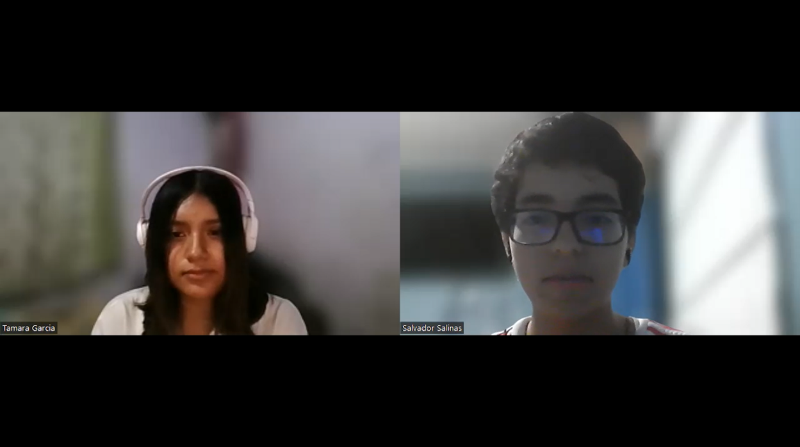

_Imagen 4. Entrevista a Tamara_

**Resumen:**

Tamara García es una potencial asesora en la cría de cuyes y está dispuesta a aconsejar a criadores principiantes en la granja de cuyes. Su principal recurso es la experiencia que ha ganado gracias a su familia, y cuenta cómo desde pequeña está familiarizada con la cría de cuyes y la gestión de granja de cuyes. Al comentarle un poco sobre la idea de la plataforma “AgroConnect”, menciona que le gustó mucho la idea ya que no ha visto algo parecido anteriormente, especialmente dirigido a la granja de cuyes. Asimismo, comenta que debería ser una aplicación fácil de usar y accesible para todos.

**Entrevista N 3 - Asesor:**

**Entrevistador:** Sebastian Paredes

**Entrevistado:** Belen Ramos

**Link de la entrevista:** https://youtu.be/xwnwEvw3LxI

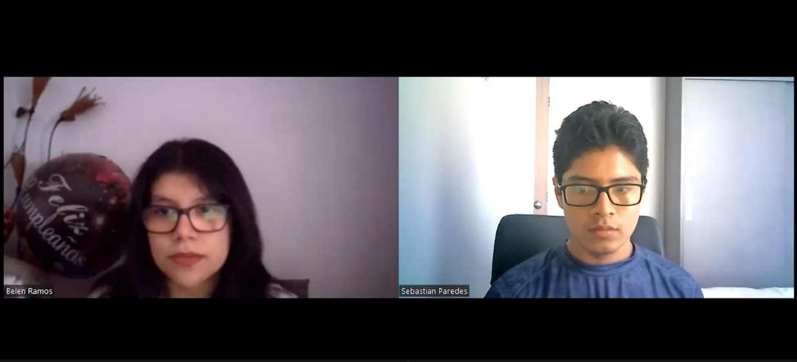

_Imagen 5. Entrevista a Belen_

**Resumen:**

Belen Ramos, la entrevistada, tiene un año de experiencia en la crianza de cuyes y ofrece asesoramiento básico sobre aspectos como la alimentación y el control de enfermedades. Utiliza recursos en línea y su experiencia personal para brindar consejos prácticos a criadores principiantes. Considera que una plataforma como "AgroConnect" sería beneficiosa para conectar con criadores y abordar temas relevantes como la selección de razas y el manejo de enfermedades.

**Entrevista N 4- Criador:**

**Entrevistador:** Sebastian Paredes

**Entrevistado:** Alessandra Chaupis

**Link de la entrevista:** https://youtu.be/3UqveRZBafU

_Imagen 6. Entrevista a Alessandra_

**Resumen:** 

Alessandra Chaupis, una joven de 20 años que vive en San Juan de Lurigancho, se encuentra en sus inicios en el negocio de la crianza de cuyes, en la entrevista destaca que su operación agropecuaria es de tamaño mediano, gracias a esta escala puede gestionar todas las actividades de cuidado y producción de manera efectiva, manteniendo un equilibrio entre la rentabilidad y la atención individualizada que requieren los cuyes. Los principales desafíos que enfrenta en su granja son el control de enfermedades, la gestión de la alimentación adecuada y el mantenimiento de las condiciones sanitarias para garantizar la salud y el bienestar de los animales y la calidad de los productos. Utiliza un registro manual y aplicaciones móviles para el seguimiento de la salud de los cuyes, así como un calendario para planificar las tareas diarias. Además, utiliza información meteorológica y datos históricos de producción para tomar decisiones informadas. Además, tiene una experiencia positiva con aplicaciones móviles de gestión de granjas, que le han permitido mejorar la eficiencia de su operación. Busca acceso a información sobre nuevas técnicas de crianza y mejores prácticas de manejo, y considera que recibir asesoramiento de criadores más experimentados sería beneficioso para mejorar la eficiencia y productividad de su granja.

**Entrevista N 5 - Criador:** 

**Entrevistador:** Nadia Lucas

**Entrevistado:** Nayeli Chavez

**Link de la entrevista:** https://youtu.be/xM3fyi4a-To 

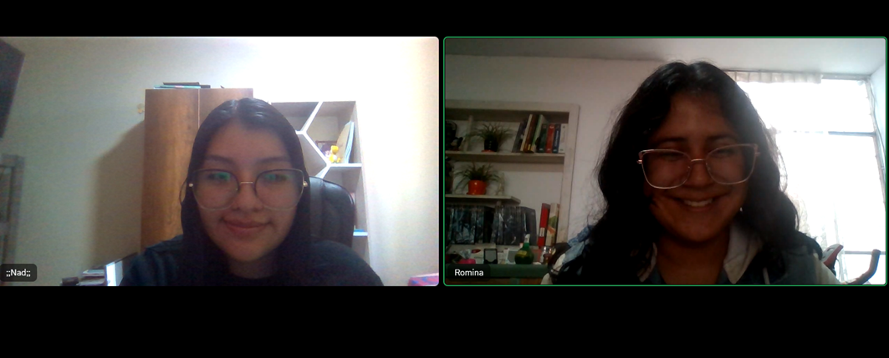

_Imagen 7. Entrevista a Nayeli_

**Resumen:**

Nayeli Chávez, una criadora de 24 años que reside en Puente Piedra, es relativamente nueva en el negocio que maneja junto a su madre, crían alrededor de 50 cuyes debido a su alta demanda. Sus desafíos incluyen mantener la salud y condiciones ambientales adecuadas para los animales, así como gestionar su alimentación y espacio. Actualmente lleva registros manuales de la salud de cada cuy y planifica sus tareas diarias para garantizar un cuidado constante. Utiliza información sobre madurez sexual y ciclos reproductivos para tomar decisiones en su granja y está abierta a explorar aplicaciones que faciliten la gestión. Busca acceso a recursos sobre prácticas de cría avanzadas y considera valiosa la orientación de criadores más experimentados a través de plataformas en línea o aplicaciones.

**Entrevista N 6 - Criador:**

**Entrevistador:** Piero Delgado

**Entrevistado:** Daniel Ruiz

**Link de la entrevista:** https://youtu.be/Lst4qVknGrk?si=2-f34iRuoXJ4amyC

_Imagen 8. Entrevista a Daniel_

**Resumen:**

Daniel viene de una familia que ha criado cuyes durante generaciones para generar un ingreso para su familia. Su familia maneja una operación mediana con alrededor de 30 cuyes. Uno de los desafíos más grandes para su criadero es mantener la salud y el bienestar de los cuyes, así como garantizar una alimentación adecuada y prevenir enfermedades. Para registrar la información de los cuyes, utiliza métodos manuales donde detalla la salud de cada animal y realiza revisiones periódicas para detectar problemas. Daniel no ha utilizado aplicaciones especializadas pero usa herramientas simples como calculadora y calendario. Está interesado en una herramienta intuitiva para gestionar la información de los cuyes y recibir asesoramiento en línea. Estaría dispuesto a pagar por una aplicación con estas funcionalidades si el precio es asequible.

### 2.2.3. Análisis de entrevistas

**Formas de difusión de información de los asesores**
|Formas de difusión|Rodrigo|Tamara|Belen|
| - | - | - | - |
|Charlas|X| | |
|Grupos de discusion en línea|X| |X|
|Visita presencial| |X|X|
|Videos en línea| | |X|

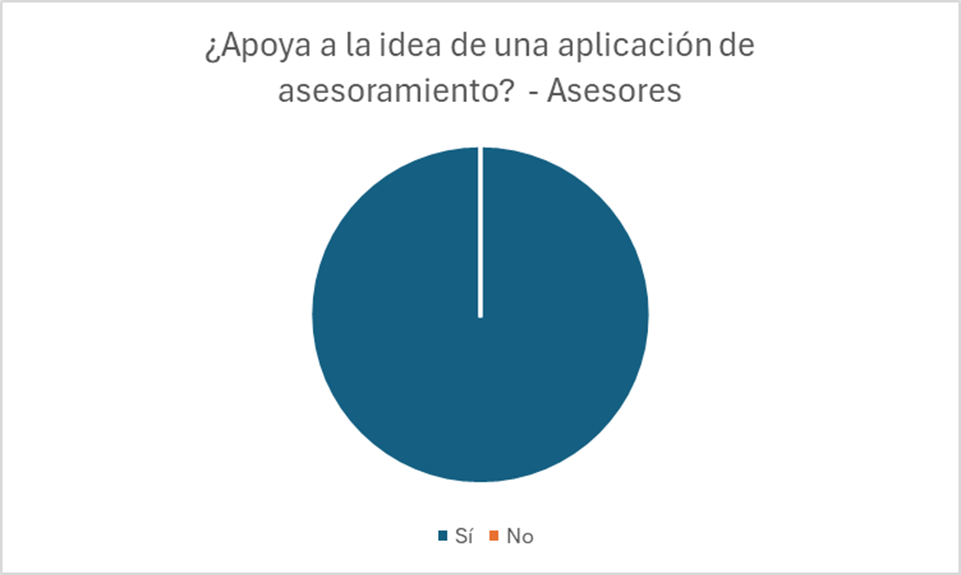

_Imagen 9. Gráfico circular - Asesores_

Gracias a las entrevistas realizadas, comprendimos que los asesores suelen brindar apoyo a través de internet o a conocidos. Así, al comentarle sobre nuestra idea de aplicación web para poder brindar asesorías a criadores de cuyes, indicaron que les pareció muy buena idea ya que brinda mejor comunicación y confiabilidad.

**Desafíos que tienen los asesores con la crianza de cuyes**
|Desafíos de crianza|Alessandra|Nayeli|Daniel|
| - | - | - | - |
|Gestión de alimentación|X|X|X|
|Mantenimiento de galpones|X| | |
|Control de enfermedades|X|X|X|
|Gestión de espacio| |X| |

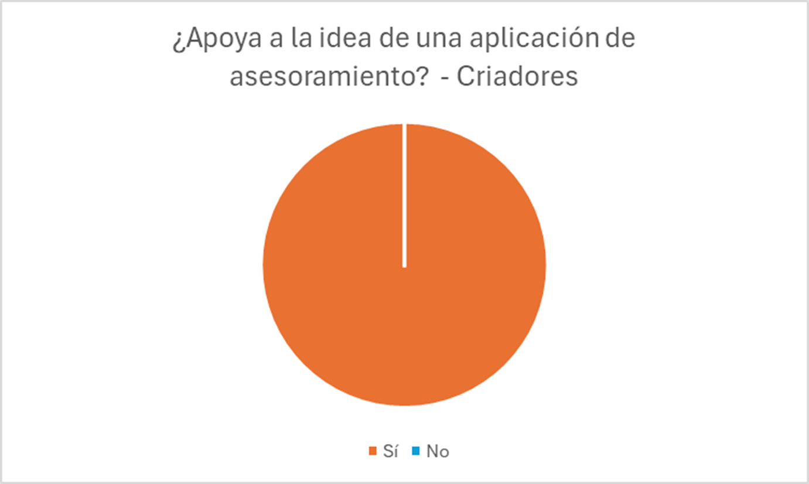

_Imagen 10. Gráfico circular - Criadores_

Asimismo, obtuvimos la conclusión de que los criadores de cuyes suelen tener dificultad para gestionar correctamente la alimentación y control de enfermedades, además de gestionar recursos de la granja en sí. De esta forma, al comentarle sobre nuestra idea de aplicación web para poder recibir asesorías de personas con experiencia y gestionar los recursos de su granja, indicaron que les pareció muy buena idea ya que sería un mejor recurso para obtener información confiable.

## 2.3. Needfinding

### 2.3.1. User Personas

Para la realización de las fichas de User Personas se han considerado los 2 segmentos objetivos: asesores y criadores de cuyes. Se elaborarán las fichas con la información recopilada de las entrevistas sobre su perfil.

**Segmento Asesor**

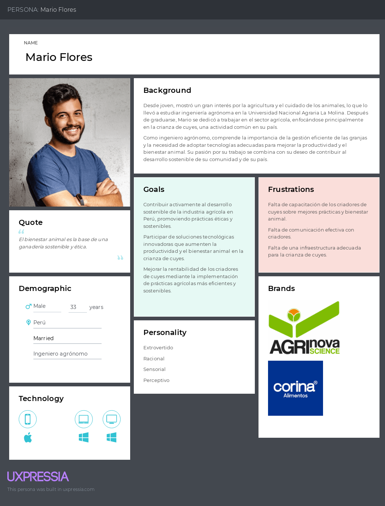

_Imagen 11. User Persona - Asesor_

**Segmento Criador**

_Imagen 12. User Persona - Criador_

### 2.3.2. User Task Matrix

<table>
  <tr>
    <th rowspan="2" valign="top"><b>Task Matrix</b></th>
    <th colspan="2" valign="top"><b>Asesores</b></th>
    <th colspan="2" valign="top"><b>Criadores</b></th>
  </tr>
  <tr>
    <td valign="top"><b>Frecuencia</b></td>
    <td valign="top"><b>Importancia</b></td>
    <td valign="top"><b>Frecuencia</b></td>
    <td valign="top"><b>Importancia</b></td>
  </tr>
  <tr>
    <td>Alimentar a los cuyes</td>
    <td>Nunca</td>
    <td>Ninguna</td>
    <td>Diaria</td>
    <td>Alta</td>
  </tr>
  <tr>
    <td>Proporcionar agua limpia</td>
    <td>Nunca</td>
    <td>Ninguna</td>
    <td>Diaria</td>
    <td>Alta</td>
  </tr>
  <tr>
    <td>Limpiar jaulas</td>
    <td>Nunca</td>
    <td>Ninguna</td>
    <td>Semanal</td>
    <td>Media</td>
  </tr>
  <tr>
    <td>Comprar suministros y alimentos</td>
    <td>Nunca</td>
    <td>Ninguna</td>
    <td>Mensual</td>
    <td>Media</td>
  </tr>
  <tr>
    <td>Vender cuyes</td>
    <td>Nunca</td>
    <td>Ninguna</td>
    <td>Mensual</td>
    <td>Alta</td>
  </tr>
  <tr>
    <td>Gestionar gastos y ganancias</td>
    <td>Mensual</td>
    <td>Media</td>
    <td>Mensual</td>
    <td>Alta</td>
  </tr>
  <tr>
    <td>Monitorear la salud y el bienestar de los cuyes</td>
    <td>Mensual</td>
    <td>Alta</td>
    <td>Siempre</td>
    <td>Alta</td>
  </tr>
  <tr>
    <td>Investigar sobre nuevas prácticas y tecnologías para la crianza de cuyes</td>
    <td>Mensual</td>
    <td>Media</td>
    <td>Casi Nunca</td>
    <td>Baja</td>
  </tr>
  <tr>
    <td>Realizar seguimiento y evaluación de progreso de granjas</td>
    <td>Semanal</td>
    <td>Alta</td>
    <td>Semanal</td>
    <td>Alta</td>
  </tr>
  <tr>
    <td>Participar de sesiones de asesoramiento para recibir información actualizada</td>
    <td>Mensual</td>
    <td>Media</td>
    <td>Mensual</td>
    <td>Media</td>
  </tr>
  <tr>
    <td>Resolver problemas específicos en las granjas</td>
    <td>Según necesidad</td>
    <td>Muy Alta</td>
    <td>Según necesidad</td>
    <td>Muy Alta</td>
  </tr>
  <tr>
    <td>Desarrollar y/o asistir a sesiones de capacitación sobre técnicas de crianza</td>
    <td>A veces</td>
    <td>Alta</td>
    <td>A veces</td>
    <td>Media</td>
  </tr>
  <tr>
    <td>Elaborar y/o leer informes de progreso con recomendaciones</td>
    <td>Trimestral</td>
    <td>Alta</td>
    <td>Trimestral</td>
    <td>Alta</td>
  </tr>
  <tr>
    <td>Evaluar las condiciones y necesidades de las granjas de forma presencial</td>
    <td>Casi nunca</td>
    <td>Alta</td>
    <td>Diaria</td>
    <td>Media</td>
  </tr>
</table>

 
A partir del User Task Matrix, resaltaremos las tareas de mayor trascendencia. Entre ellas tenemos ‘monitorear la salud y bienestar de los cuyes’ ya que los criadores están pendientes constantemente de la salud de los cuyes viendo comportamientos inusuales y posibles enfermedades para comunicárselo a los asesores quienes otorgarían consejos sobre el accionar ante una posible enfermedad o comportamiento inusual. Esta tarea es fundamental para que haya una producción exitosa y sin contratiempos.

Asimismo, la tarea de ‘realizar seguimiento y evaluación de progreso de granjas’ es fundamental por el mismo motivo porque permite una mejora continua en el rendimiento de las granjas.

Por otro lado, las principales diferencias entre ambos segmentos radican en las actividades diarias dentro del criadero ya que solo participan los criadores para asegurarse de la salud y crecimiento de los cuyes. Por lo tanto, los criadores están monitoreando constantemente las condiciones de sus granjas, mientras que los asesores tienen que separar una fecha para realizar esto de forma presencial.

Finalmente, la principal coincidencia encontrada es que tanto los asesores como los criadores deben estar preparados para solucionar problemas específicos cuando estos aparezcan.

### 2.3.3. User Journey Mapping

Para el segmento de los asesores especializados, se ha considerado desde el momento en que reciben una solicitud de servicio por parte de un criador de cuyes hasta el seguimiento de los avances con respecto a los cambios planteados.
Por otro lado, para el segmento de criadores de cuyes se tomó en cuenta desde la búsqueda inicial de información y contactos de asesores hasta la implementación de nuevos conocimientos y el análisis de resultados obtenidos.

**Segmento Asesor**

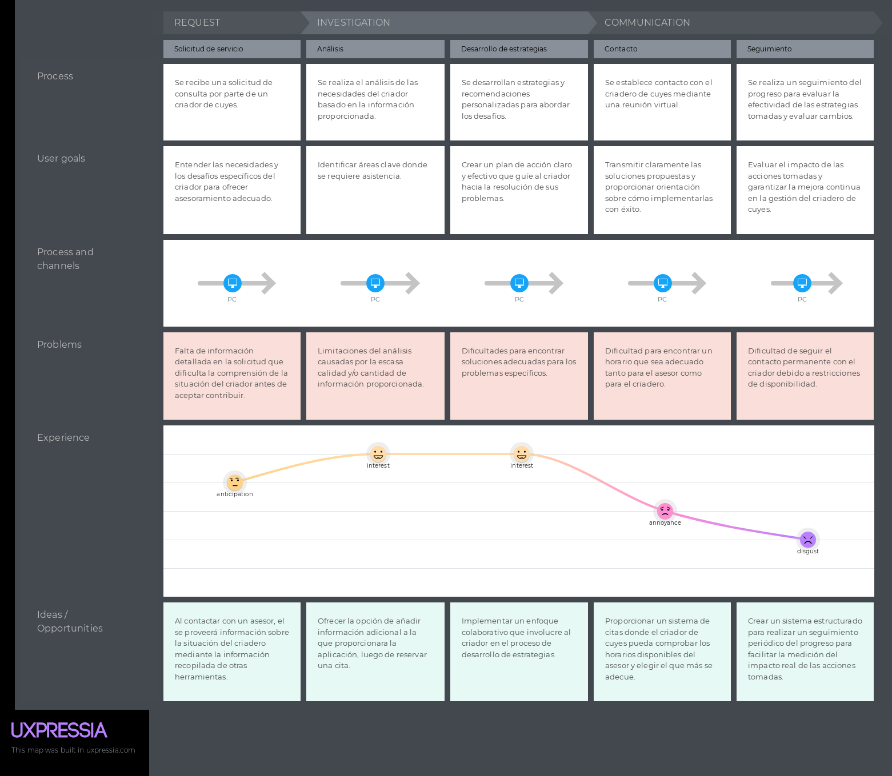

_Imagen 13. User Journey Map - Asesor_

**Segmento Criador**

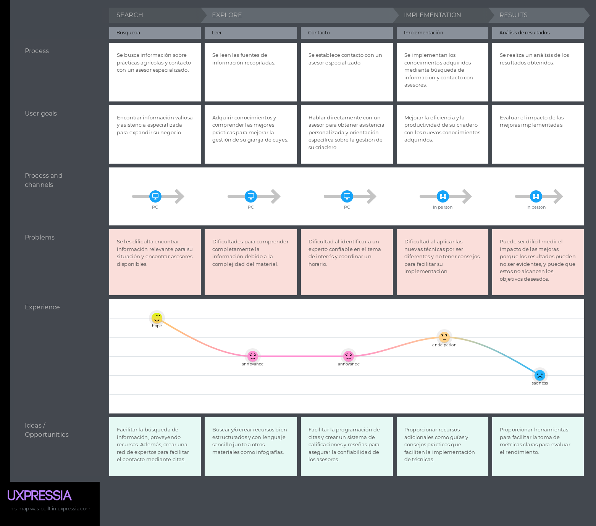

_Imagen 14. User Journey Map - Criador_

### 2.3.4. Empathy Mapping

En esta sección, se desarrollaron los Empathy Maps de cada segmento objetivo. Se utilizó una plantilla de EXPressia que contiene los apartados que debe tener el Empathy Map junto a preguntas que se respondieron conforme a lo identificado de nuestro segmento objetivo para desarrollar este artefacto.

**Segmento Asesor**

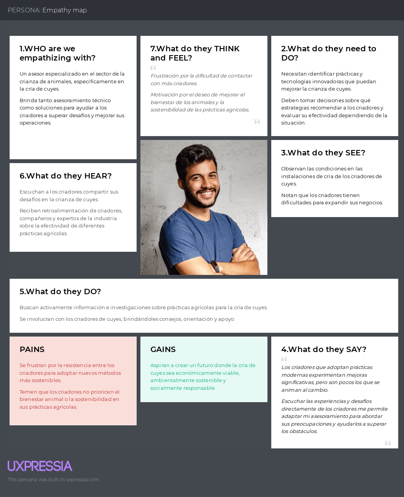

_Imagen 15. Empathy Map - Asesor_

**Segmento Criador**

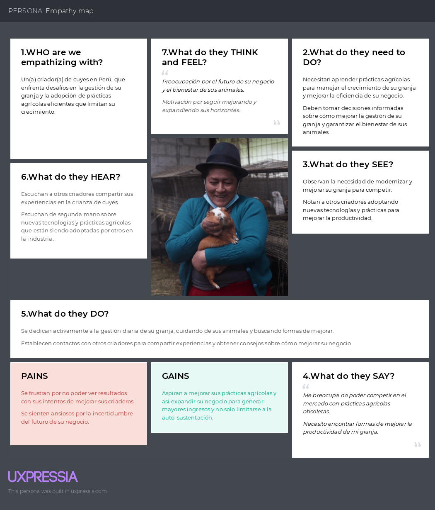

_Imagen 16. Empathy Map - Criador_

### 2.3.5. As-is Scenario Mapping
**Segmento: Asesor**

|**Phases**|**Búsqueda de de trabajo**|**Publicar su experiencia en el rubro** |**Comunicación con el ganadero**|**Asesorar al ganadero**|
| :- | :- | :- | :- | :- |
|**Doing**|- Busca la manera de llegar a más público, creándose  foros de difusión, cuentas de instagram,etc.Para que así más personas adquieran sus servicios.|- Habiendo creado su perfil, empieza a publicar información acerca de él, la experiencia que tiene en el campo, el rubro con el que se especializa, entre otros datos relevantes que ayuden a captar el interés del cliente.|-Se comunica con el ganadero mediante whatsapp, instagram o en llamadas cortas explicando los beneficios de su servicio.|- Mediante whatsapp y luego de haber llegado a un acuerdo se reúne con el ganador para poder asesorar en lo que necesita|
|**Thinking**|- "Necesito que me contraten para poder generar ingresos."|- "Espero que la información que publique interese a los clientes."|- "Es importante comunicarse con la persona, sin embargo no llegó a comprender que exactamente desea."|- "El asesoramiento que brinda al ganadero ha sido no tan eficiente pero sí eficaz."|
|**Feeling**|
-Estresado por no saber donde debo posicionarme para poder buscar trabajo. 

- Decepcionado por no conocer una página o aplicación que me brinde la facilidad de conectar con mis clientes.
|
- Preocupado sobre qué dirán las personas al ver lo que ofrezco.

- Tímido al publicar mi información en mi feed.
|
- Satisfecho por haber conseguido un cliente dispuesto a contratarme.

- Confundido porque el cliente no detalla bien qué servicio  desea  de mí.
|
- Satisfecho de haber culminado mi asesoramiento continuo al cliente.

-Frustrado por el tiempo que me demore en asesorar debido a la gran cantidad de herramientas que he usado.
|

**Segmento: Criador**

|**Phases**|**Búsqueda de Información y Asesoramiento**|**Comunicación con el Asesor** |**Registro de Datos y Asesoramiento**|**Uso Continuo**|
| :- | :- | :- | :- | :- |
|**Doing**|- Busca información sobre la crianza de cuyes en línea y en libros especializados.|- Contacta a un asesor a través de la aplicación para obtener asesoramiento sobre la crianza de su ganado de cuyes.|
- Proporciona detalles sobre su ganado de cuyes, como la cantidad, la salud, la alimentación y otros aspectos relevantes, al asesor. 

- Recibe asesoramiento y recomendaciones del asesor.
|- Mantiene una comunicación regular con el asesor para recibir orientación continua sobre la crianza de su ganado de cuyes.|
|**Thinking**|- "Necesito encontrar información precisa y útil para mejorar la crianza de mi ganado de cuyes."|- "Espero que el asesor tenga el conocimiento necesario para ayudarme."|- "Es importante proporcionar datos precisos para recibir un asesoramiento efectivo."|- "La relación continua con el asesor es clave para el éxito de mi ganado de cuyes."|
|**Feeling**|
- Motivado por mejorar la salud y la productividad de su ganado de cuyes.

`- Interesado en aprender más sobre la crianza de cuyes
|
- Optimista sobre la posibilidad de recibir asesoramiento valioso del asesor.

- Satisfecho al establecer una comunicación efectiva.
|
- Satisfecho por recibir recomendaciones que benefician a su ganado de cuyes. 

- Responsable de seguir las recomendaciones del asesor.
|
- Satisfecho con la relación continua con el asesor. 

- Comprometido con mejorar su ganadería de cuyes a largo plazo.
|

## 2.4. Ubiquitous Language

En esta sección, se definirán términos utilizados a lo largo del proyecto para que se pueda comprender para todos los miembros del equipo y agentes interesados. 

- **Guinea pig breeder** (Criador de cuyes):** Persona dedicada a la crianza y producción de cuyes con el fin de obtener carne y otros productos derivados de estos animales.
- **Ganadero** (Rancher): Individuo dedicado a la crianza de animales. En este contexto, es otra forma de llamar a los criadores de cuyes, pero de forma más general. Los ganaderos son responsables del cuidado diario de los cuyes, incluida la alimentación, el manejo del hábitat y la reproducción.
- **Advisor** (Asesor): En el contexto del proyecto, es una persona con experiencia y conocimientos especializados en la crianza de cuyes y prácticas agrícolas relacionadas. Su papel es brindar apoyo personalizado para resolver desafíos específicos que enfrentan los criadores en el cuidado de los cuyes.
- **Guinea pig farm** (Granja de cuyes):** Instalación destinada a la cría y manejo de cuyes, equipada con las infraestructuras necesarias para su cuidado y reproducción.
- **Animal welfare** (Bienestar animal):** Estado de salud física y psicológica de los cuyes que garantiza su crecimiento óptimo, garantizado mediante prácticas de crianza adecuadas que respetan sus necesidades naturales.
- **Sustainable agricultural practices** (Prácticas agrícolas sostenibles):** Técnicas y métodos de producción que preservan los recursos naturales y minimizan el impacto ambiental negativo, contribuyendo a la conservación a largo plazo del medio ambiente y los ecosistemas.

- **Self-sustainable** (Auto-sustentable): En el contexto de la crianza de cuyes, se refiere a la práctica de consumir los cuyes criados en la granja principalmente para satisfacer las necesidades alimenticias de los criadores y sus familias. En lugar de venderlos para generar ingresos adicionales.

- **Shed** (Galpón): Es el ambiente donde se construyen o colocan las pozas o jaulas para criar a los cuyes, lo que permite un mejor control de los animales.

- **Cage** (Jaula): Espacio donde vive un grupo de cuyes normalmente construidos de madera o mallas metálicas.

- **Resources** (Recursos): Elementos físicos necesarios para la crianza de cuyes como el alimento que consumen los cuyes, la medicina para los cuyes enfermos, o recursos de producción como pueden ser las pieles de los cuyes.

- **Expenses** (Gastos): Inversiones de dinero del criador para cubrir las necesidades de la crianza como puede ser la compra de los alimentos de los cuyes.

- **Review** (Reseña): Evaluación del desempeño de un asesor durante una cita. Consta de calificación (con rango de 0 a 5 estrellas) y de un comentario opcional.

- **Appointment** (Cita): Encuentro programado entre el criador y el asesor con el objetivo de recibir asistencia técnica en desafíos en la crianza, y con el objetivo de recibir recomendaciones.

# Capítulo III Requirements Specification
## 3.1. To-Be Scenario Mapping
**Segmento: Asesor** 

|**Phases**|**Búsqueda de de trabajo**|**Publicar su experiencia en el rubro** |**Comunicación con el ganadero**|**Asesorar al ganadero**|
| :- | :- | :- | :- | :- |
|**Doing**|- Ingreso a la aplicación “AgroConnect” y me registro como asesor.|- Habiendo creado mi cuenta, ingreso a mi perfil y lo diseñó a mi gusto sin límites para que el cliente sepa lo que ofrezco, además resalto mi calificación y las reseñas positivas que he tenido con el asesoramiento a otros clientes.|-Acepto la solicitud que me envió un cliente el cual resalta lo que necesita de manera detallada, luego me comunico con él mediante la misma aplicación y coordino algunos aspectos de la solicitud.|- Me reúno con el ganadero luego de coordinar mediante la aplicación,para luego asesorar usando todas las herramientas que me brinda la aplicación siendo rápido y eficiente.|
|**Thinking**|- "Que bueno que haya un sitio exclusivo para asesores en la ganadería "|- “Me encanta detallar toda mi información de manera concisa."|- "Me encanta lo rápido que es  entender al cliente, gracias a la solicitud detallada que me manda y que de igual manera podamos comunicarnos en la misma aplicación."|- "El asesoramiento que brinda al ganadero ha sido eficiente y rápido debido a las herramientas que me proporciona la aplicación."|
|**Feeling**|
-Tranquilo por lo fácil que fue para el registrase en la aplicación. 

- Contento porque existe una aplicación que lo ayude a hacerse más reconocido.
|
- Entusiasmado en los nuevos clientes que llegare a tener por la información que les he brindado 

` `- Feliz por poder resaltar mi empeño como asesor mediante reseñas y puntajes.
|
- Satisfecho por haber comprendido al cliente de manera rapido.

` `- Cómodo por la manera en la cual me he comunicado con el cliente.
|
- Satisfecho de haber culminado mi asesoramiento continuo al cliente.

-Encantado  por las herramientas que me brinda la aplicación para poder asesorar bien al ganadero.
|

**Segmento: Criadores** 

|**Phases**|**Búsqueda de Información y Asesoramiento**|**Comunicación con el Asesor** |**Registro de Datos y Asesoramiento**|**Uso Continuo**|
| :- | :- | :- | :- | :- |
|**Doing**|
- Navega por la aplicación en busca de información relevante sobre la crianza de ganado de cuyes

|- Inicia una conversación en la aplicación con el asesor para obtener detalles específicos sobre su ganado de cuyes.|
- Registra los datos de su ganado de cuyes, incluyendo su salud, alimentación y otros detalles relevantes en la aplicación. 

- Recibe asesoramiento y recomendaciones del asesor.
|- Continúa interactuando con el asesor a lo largo del tiempo, el cual le va brindando asesoramiento y seguimiento regular.|
|**Thinking**|- "Necesito encontrar información precisa y útil que me ayude con mi ganado de cuyes"|- "Espero obtener información detallada del asesor para gestionar mi granja de cuyes de manera  adecuada."|- "Es importante proporcionar datos precisos para recibir un asesoramiento efectivo."|- "Mantener una comunicación continua con el asesor es esencial para el éxito de mi granja."|
|**Feeling**|- Interesado mucho más en aprender más sobre la ganadería de cuyes. |- Satisfecho al establecer una comunicación efectiva.|
- Satisfecho por contribuir al bienestar de su ganado de cuyes.

 
|
- Satisfecho con la relación continua con el asesor. 

- Comprometido con el cuidado de su granja.
|

## 3.2. User Stories

Se identificaron las siguientes épicas que se componen de las historias de usuario.

<table>
    <tr>
        <th valign="top"><b>Epic ID</b></th>
        <th valign="top"><b>Epic</b></th>
        <th valign="top"><b>User story ID</b></th>
        <th valign="top"><b>User stories</b></th>
    </tr>
    <tr>
        <td rowspan="8" valign="top"><b>E01</b></td>
        <td rowspan="8" valign="top">Sistema de búsqueda y programación de citas con asesores y calificaciones</td>
        <td valign="top">US01</td>
        <td valign="top">Búsqueda de asesores</td>
    </tr>
    <tr>
        <td valign="top">US02</td>
        <td valign="top">Información del asesor</td>
    </tr>
    <tr>
        <td valign="top">US03</td>
        <td valign="top">Visualización de horarios</td>
    </tr>
    <tr>
        <td valign="top">US04</td>
        <td valign="top">Programación de citas</td>
    </tr>
    <tr>
        <td valign="top">US05</td>
        <td valign="top">Información relevante previa cita</td>
    </tr>
    <tr>
        <td valign="top">US06</td>
        <td valign="top">Notificación de citas al asesor</td>
    </tr>
    <tr>
        <td valign="top">US07</td>
        <td valign="top">Notificación de citas al criador</td>
    </tr>
    <tr>
        <td valign="top">US08</td>
        <td valign="top">Calificación del asesor</td>
    </tr>
    <tr>
        <td rowspan="2" valign="top"><b>E02</b></td>
        <td rowspan="2" valign="top">Publicaciones en la aplicación</td>
        <td valign="top">US09</td>
        <td valign="top">Publicación del asesor</td>
    </tr>
    <tr>
        <td valign="top">US10</td>
        <td valign="top">Ver publicación de asesor</td>
    </tr>
    <tr>
        <td rowspan="4" valign="top"><b>E03</b></td>
        <td rowspan="4" valign="top">Sistema integral de registro y seguimiento animal</td>
        <td valign="top">US11</td>
        <td valign="top">Registro de galpones de cuyes</td>
    </tr>
    <tr>
        <td valign="top">US12</td>
        <td valign="top">Registro de animal</td>
    </tr>
    <tr>
        <td valign="top">US13</td>
        <td valign="top">Visualización y edición de información de animales</td>
    </tr>
    <tr>
        <td valign="top">US14</td>
        <td valign="top">Registro de fallecimiento de cuyes</td>
    </tr>
    <tr>
        <td rowspan="2" valign="top"><b>E04</b></td>
        <td rowspan="2" valign="top">Gestión de granja</td>
        <td valign="top">US15</td>
        <td valign="top">Gestión de recursos</td>
    </tr>
    <tr>
        <td valign="top">US16</td>
        <td valign="top">Gestión de gastos realizados</td>
    </tr>
    <tr>
        <td rowspan="2" valign="top"><b>E05</b></td>
        <td rowspan="2" valign="top">Eficiencia y seguridad de aplicación</td>
        <td valign="top">US17</td>
        <td valign="top">Seguridad de información</td>
    </tr>
    <tr>
        <td valign="top">US18</td>
        <td valign="top">Disponibilidad y confiabilidad</td>
    </tr>
    <tr>
        <td rowspan="3" valign="top"><b>E06</b></td>
        <td rowspan="3" valign="top">Registro, acceso a la aplicación y datos personales</td>
        <td valign="top">US19</td>
        <td valign="top">Registro de usuario</td>
    </tr>
    <tr>
        <td valign="top">US20</td>
        <td valign="top">Inicio de sesión</td>
    </tr>
    <tr>
        <td valign="top">US21</td>
        <td valign="top">Recuperación de contraseña</td>
    </tr>
    <tr>
        <td rowspan="6" valign="top"><b>E07</b></td>
        <td rowspan="6" valign="top">Visualización de una Landing Page estática</td>
        <td valign="top">US22</td>
        <td valign="top">Visualización de Navbar y Footer</td>
    </tr>
    <tr>
        <td valign="top">US23</td>
        <td valign="top">Página de inicio</td>
    </tr>
    <tr>
        <td valign="top">US24</td>
        <td valign="top">Sección “Acerca De”</td>
    </tr>
    <tr>
        <td valign="top">US25</td>
        <td valign="top">Sección “Sobre Nosotros”</td>
    </tr>
    <tr>
        <td valign="top">US26</td>
        <td valign="top">Sección “Características”</td>
    </tr>
    <tr>
        <td valign="top">US27</td>
        <td valign="top">Sección “Contacto”</td>
    </tr>
</table>

|**Epic / Story ID**|**Título**|**Descripción**|**Criterios de Aceptación**|**Relacionado con (Epic ID)**|
| :- | :- | :- | :- | :- |
|US01|Búsqueda de Asesores|**Como** criador de cuyes **quiero** explorar asesores **para** recibir una mentoría.|
**Escenario 1: Explorar Asesores**

**Given** el criador quiere explorar asesores.

**And** se encuentra en el apartado de “Asesores” Sidebar.

**When** seleccione el botón “Explorar Asesores”.

**Then** el sistema le mostrará una lista de todos los asesores disponibles en la aplicación.

**Escenario 2: Filtrar búsqueda de Asesores**

**Given** el criador quiere personalizar su búsqueda.

**And** se encuentra explorando asesores.

**When** seleccione el botón de filtros.

**Then** el sistema** le permitirá elegir asesores por ubicación, experiencia o reputación.

**Escenario 3: Ver mis asesores**

**Given** el criador desea ver los asesores a los que les solicitó un servicio para recibir una mentoría.

**And** se encuentra en el apartado de “Asesores” de la SideBar.

**When** haga clic en el botón “Mis Asesores”

**Then** el sistema le mostrará una lista de todos los asesores a los que ha solicitado una cita.

|E01|
|US02|Información del asesor|**Como** criador de cuyes **quiero** tener acceso a la información del asesor **para** tomar una decisión informada antes de separar una cita|
**Escenario 1: Ver información del asesor** 

**Given** el criador quiere ver información relevante del asesor.

**And se** encuentra en el apartado de “Asesores” de la Sidebar.

**When** seleccione a un asesor.

**Then** el sistema le mostrará la información del asesor como experiencia, calificación y comentarios.

**Escenario 2: Fallar al visualizar la información del asesor**

**Given** el criador quiere ver información relevante del asesor.

**And se** encuentra en el apartado de “Asesores”

**When** seleccione a un asesor.

**And** se encuentre con un error al cargar la información.

**Then** el sistema le mostrará un mensaje de error indicando que hubo un error de carga.
|E01|
|US03|Visualización de horarios|**Como** criador de cuyes **quiero** ver la disponibilidad de los asesores **para** seleccionar un horario que se ajuste a mi agenda|
**Escenario 1: Visualizar horarios disponibles**

**Given** el criador desea visualizar los horarios disponibles del asesor elegido.

**And** se encuentra mirando el perfil de un asesor.

**When** haga clic en el botón “Reservar Cita”

**Then** el sistema le mostrará una interfaz con los horarios disponibles del asesor

**Escenario 2: Fallar al intentar visualizar horarios.**

**Given** el criador desea visualizar los horarios disponibles del asesor elegido.

**And** se encuentra mirando el perfil de un asesor.

**When** haga clic en el botón “Reservar Cita”

**And** el asesor no tenga horarios disponibles

**Then** el sistema le mostrará un mensaje de error “El asesor no tiene horarios disponibles”.
|E01|
|US04|Programación de citas|**Como** criador de cuyes **quiero** poder programar una cita con un asesor **para** recibir orientación personalizada|
**Escenario 1: Programar cita exitosa**

**Given** el criador desea programar una cita.

**And** se encuentra en el apartado de “Horarios Disponibles” del perfil de un asesor.

**When** seleccione un horario disponible

**And** complete los campos solicitados.

**And** haga clic en el botón “Reservar Cita”

**Then** el sistema le mostrará un mensaje de confirmación.

**Escenario 2: Fallar al programar cita**

**Given** el criador desea programar una cita.

**And** se encuentra en el apartado de “Horarios Disponibles” del perfil de un asesor.

**When** seleccione un horario disponible

**And** se encuentra un error técnico o de conexión que impide completar la programación.

**Then** el sistema le mostrará un mensaje de error sugiriendo contactar con soporte.
|E01|
|US05|Información relevante previa cita|**Como** asesor **quiero** tener acceso al detalle de la cita **para** decidir si aceptar o no el trabajo.|
**Escenario 1: Ver Información del cita**

**Given** el asesor desea ver información de la cita para tomar una decisión.

**And** se encuentra en la sección de “Mis Citas” .

**And** observa que tiene una cita programada con un criador.

**When** haga clic en la card de la cita.

**Then** el sistema le permitirá ver el detalle y analizar si puede aceptar o no el trabajo.

**Escenario 2: Ver Información del criador**

**Given** el asesor desea ver información de la cita para tomar una decisión.

**And** está visualizando el detalle de la cita.

**When** haga clic en el botón “Ver perfil del criador”

**Then** el sistema le mostrará información relevante del criador.

**Escenario 3: Fallar al acceder a la información del criador**

**Given** el asesor desea ver información de la cita para tomar una decisión.

**And** está visualizando el detalle de la cita.

**When** haga clic en el botón “Ver perfil del criador”.

**And** se encuentre con un error al cargar la información.

**Then** el sistema le mostrará un mensaje de error indicando que hubo un error de carga.
|E01|
|US06|Notificación de citas al asesor|**Como asesor, quiero** recibir notificaciones de citas programadas por los criadores **para** mantenerme al tanto de mis ofertas laborales.|
**Escenario 1: Ver notificaciones de cita programadas por criadores**

**Given** el asesor desea ver sus notificaciones de citas programadas.

**When** se encuentre en el apartado de “Notificaciones”

**Then** el sistema le mostrará un mensaje que describe brevemente la solicitud.

**Escenario 2: Redireccionarse al apartado de “Mis Citas”**

**Given** el asesor desea el detalle de una notificación.

**When** haga clic en la notificación.

**Then** el sistema lo redireccionará al apartado de “Mis Citas” de la Sidebar, donde podrá ver a detalle la solicitud.

**Escenario 3: Aceptar cita de el apartado de notificaciones**

**Given** el asesor desea aceptar una cita rápidamente

**When** haga clic en el botón “Aceptar” dentro de la card de notificación.

**Then** el sistema notificará esta acción al criador.

**Escenario 4: Rechazar cita de el apartado de notificaciones**

**Given** el asesor desea rechazar una cita rápidamente

**When** haga clic en el botón “Rechazar” dentro de la card de notificación.

**Then** el sistema le notificará esta acción al criador.
|E03|
|US07|Notificación de citas al criador de cuyes|**Como c**riador de cuyes **quiero** recibir notificaciones referentes al estado de mis citas **para** mantenerme al tanto de mi solicitud.|
**Escenario 1: Ver notificación de cita aceptada por el asesor**

**Given** el criador desea saber si el asesor aceptó o rechazó la cita.

**When** se encuentre en el apartado de “Notificaciones” de la Sidebar.

**Then** el sistema le permitirá ver la notificación “El asesor aceptó su cita {nombre de cita} a las {xx:xx} horas”.

**Escenario 2: Ver notificación de cita denegada por el asesor**

**Given** el criador desea saber si el asesor aceptó o rechazó la cita.

**When** se encuentre en el apartado de “Notificaciones” de la sidebar.

**Then** el sistema le permitirá ver la notificación “El asesor aceptó su cita {nombre de cita} a las {xx:xx} horas”.
|EO1|
|US08|Calificación del asesor|**Como** criador de cuyes **quiero** calificar al asesor luego de consulta **para** ayudar a otros criadores a tomar una decisión informada antes de separar una cita.|
**Escenario 1: Calificar al asesor**

**Given** el criador desea hacer un feedback referente al servicio del asesor.

**And** se encuentra en la vista de calificación del servicio.

**When** haga clic en el botón “Calificar Servicio”

**Then** el sistema le permitirá asignarle un número de estrellas y reseñar el servicio del asesor.

**Escenario 2: Omitir Calificación**

**Given** el criador no desea dar feedback al asesor referente al servicio.

**And** se encuentra en la vista de calificación del servicio.

**When** haga clic en el botón “Omitir calificación”

**Then** el sistema le permitirá omitir la reseña.
|E01|
|US09|Publicación del asesor|**Como** asesor **quiero** hacer publicaciones referentes a mis trabajos **para** que los criadores tengan más confianza en mí.|
**Escenario 1: Crear una nueva publicación**

**Given** el asesor desea crear una publicación.

**And** está en el apartado de "Mis Publicaciones".

**When** hace clic en el botón "Crear Publicación" de la Sidebar.

**Then** se le redirige a un formulario donde puede ingresar el contenido de su nueva publicación.

**And** después de completar el contenido, hace clic en el botón "Publicar".

**Then** el sistema le mostrará un mensaje de confirmación.

**Escenario 2: Editar una publicación existente**

**Given** el asesor desea editar una publicación existente.

**And** está en el apartado de "Mis Publicaciones" de la Sidebar.

**And** tiene una publicación previamente creada.

**When** selecciona la opción de editar en la publicación que desea modificar.

**Then** se le redirige al formulario de edición donde puede modificar el contenido de la publicación.

**And** después de realizar los cambios deseados, hace clic en el botón "Guardar Cambios".

**Then** el sistema le mostrará un mensaje de confirmación y los cambios se reflejan en la publicación actualizada.

**Escenario 3: Eliminar una publicación existente**

**Given** el asesor desea eliminar una publicación existente.

**And** está en el apartado de "Mis Publicaciones" de la Sidebar.

**And** tiene una publicación previamente creada.

**When** selecciona la opción de eliminar en la publicación que desea borrar.

**Then** el sistema le mostrará un mensaje de confirmación solicitando la confirmación de la eliminación.

**And** después de confirmar, la publicación se elimina de su perfil y ya no está disponible para los criadores.
|E02|
|US10|Visualización de publicaciones de los asesores|**Como** criador de cuyes **quiero** poder ver las publicaciones de la comunidad de asesores **para** obtener información útil y, si es necesario, solicitar asesoramiento en base a esas publicaciones.|
**Escenario 1: Visualizar publicaciones de asesores**

**Given** el criador desea ver las publicaciones de la comunidad

**When** haga clic en el botón “Publicaciones” de la Sidebar.

**Then** el sistema le mostrará una lista de las últimas publicaciones de la comunidad de asesores.

**Escenario 2: Filtrar publicaciones de asesores por fecha**

**Given** el criador desea ver las publicaciones de la comunidad de un tiempo en específico como “esta semana”, “este mes” o ingresar una fecha en específico.

**And** se encuentra visualizando las publicaciones.

**When** haga clic en el ícono de filtro.

**Then** el sistema le permitirá filtrar las publicaciones por el parámetro elegido.
|E02|
|US11|Registro de galpones de cuyes|**Como** criador de cuyes **quiero** poder registrar un galpón en la plataforma **para** poder almacenar y gestionar mis cuyes de manera efectiva, garantizando su seguridad y bienestar.|
**Escenario 1: Registro exitoso del galpón**

**Given** que el criador desea registrar su galón.

**And** se encuentra en el apartado "Registro".

**When** haga clic en el botón "Registrar Galpón".

**And** completa el formulario con la información requerida del galpón.

**And** hace clic en el botón "Registrar Galpón".

**Then** el sistema le mostrará un mensaje del registro exitoso del galpón.

**Escenario 2: Eliminar galpón**

**Given** que el criador desea eliminar su galón.

**And** se encuentra en un galpón del apartado "Mis Animales".

**When** haga clic en el botón "Borrar".

**Then** el sistema le mostrará un mensaje de confirmación solicitando la confirmación de la eliminación.

**And** después de confirmar, el galpón se elimina.
|E03|
|US12|Registro de animal|**Como** criador de cuyes **quiero** contar con un sistema de registro de animales **para** almacenar información básica sobre cada animal, incluyendo su número de identificación, especie, raza, género y fecha de nacimiento.|
**Escenario 1: Registrar un nuevo animal**

**Given** el criador desea registrar un cuy en su galpón.

**And** se encuentra en el apartado de “Registro”.

**When** haga clic en el botón ”Nuevo cuy”

**And** ingresa la información básica del animal, incluyendo su número de identificación, número de galpón, especie, raza, género, fecha de nacimiento o edad y el galpón en donde se va a encontrar.

**And** haga clic “Registrar”

**Then** el sistema le mostrará una confirmación del registro.

**Escenario 2: Fallar en el registro de animal**

**Given** el criador desea registrar un cuy en su galpón.

**And** se encuentra en el apartado de “Registro”.

**When** haga clic en el botón ”Nuevo cuy”

**And i**ntenta ingresar la información del animal pero deja en blanco algunos campos obligatorios para el registro**.**

**And** haga clic “Registrar”.

**Then** el sistema le mostrará un mensaje de error.
|E03|
|US13|Visualización y edición de información de animales|**Como** criador de cuyes **quiero** buscar a un animal en específico **para** visualizar o actualizar su información registrada.|
**Escenario 1: Buscar y visualizar la información de un animal registrado**

**Given** el criador tiene varios animales registrados en la aplicación y desea visualizar la información de uno en específico.

**And** se encuentra en el apartado de “Mis Animales”

**When** haga clic en “Ver todos”

**And** busque al animal en específico.

**And s**eleccione al animal encontrado. 

**Then** el sistema le mostrará la información detallada del animal.

**Escenario 2: Actualizar información de un animal registrado**

**Given** el criador desea actualizar la información de un animal.

**And** ha registrado previamente un animal en la aplicación. 

**And** se encuentra viendo al animal en específico.

**When** haga clic en el botón “Editar”.

**And** realiza cambios en la información del animal.

**Then** el sistema actualizará la información del animal de manera efectiva

**And** mostrará una confirmación.
|E03|
|US14|Registrar fallecimiento de Cuy|**Como** criador de cuyes **quiero** poder registrar y documentar los fallecimientos de cuyes en mi granja **para** tomar medidas.|
**Escenario 1: Registrar fallecimiento de cuy**

**Given** el criador desea registrar el fallecimiento de un cuy.

**And**  está visualizando la información de un cuy en el apartado de “Mis Animales”

**When** haga clic en el botón “Editar”

**And**  haga clic en el botón “Marcar como fallecido”

**Then** el sistema le pedirá un confirmación para actualizar el estado del cuy.

**Escenario 2: Cancelar intención de marcar fallecimiento a cuy**

**Given** el criador se ha equivocado de animal para marcar como fallecido.

**And**  se encuentra visualizando la confirmación.

**When** haga clic en el botón “Cancelar”

**Then** el sistema lo redireccionará a la vista de los datos del cuy.

|E03|
|US15|Gestión de recursos|**Como** criador de cuyes **quiero** registrar el inventario de mi granja **para** tener un control sobre los recursos esenciales como alimentos y medicamentos.|
**Escenario 1: Registrar de nuevo ingreso de recursos en el inventario**

**Given** el criador ha recibido el pedido de recursos por parte del proveedor y desea registrar esto en su inventario.

**And** se encuentra en el apartado de “Registro” de la Sidebar.

**When** haga clic en el botón “Nuevo Recurso”

**And** ingresa los detalles de nombre y tipo de recurso, fecha, cantidad y observación.

**Then** el sistema mostrará una confirmación.

**Escenario 2:** **Actualizar recursos en el inventario**

**Given** el criador ha utilizado una cantidad de los recursos y desea actualizar el stock de algún producto.

**And** se encuentra en el apartado de “Mi Granja” de la Sidebar.

**When** haga clic en el botón “Gestión de Recursos”

**And** seleccione el recurso utilizado

**And** ingrese la cantidad que fue utilizada y la fecha de consumo

**Then** el sistema mostrará una confirmación del cambio realizado.
|E04|
|US16|Gestión de gastos realizados|**Como** criador de cuyes **quiero** registrar gastos relacionados con mi negocio **para** tener un control y poder tomar decisiones financieras que serán útiles para tener una mejor rentabilidad.|
**Escenario 1: Registrar gasto**

**Given** el criador desea registrar los gastos que ha realizado.

**And** se encuentra en el apartado de “Registro” de la Sidebar.

**When** haga clic en el botón “gastos”

**And** ingrese datos como el precio, tipo de gasto, fecha y demás campos.

**Then** el sistema registrará correctamente los detalles del gasto.

**Escenario 2: Ver gasto registrado**

**Given** el criador desea modificar un gasto ya registrado.

**And** se encuentra en el apartado de “Mi Granja” de la Sidebar.

**When** haga clic en el botón “Gestión de gastos”

**Then** el sistema le permitirá visualizar sus gastos.

**Escenario 3: Editar gasto registrado**

**Given** el criador desea modificar un gasto ya registrado.

**And** se encuentra visualizando un gasto.

**When** haga clic en el botón “Ver más” del gasto.

**And** haga clic en el botón de edición.

**Then** el sistema le permitirá reescribir el gasto.
|E04|
|US17|Seguridad de información|**Como** criador/asesor **quiero** que la aplicación cumpla con los estándares de seguridad **para** proteger mi información registrada.|
**Escenario 1: Seguridad en la conexión web**

**Given** el usuario desea que la aplicación sea segura para su uso personal.

**When** ingrese a la aplicación para hacer uso de ella.

**Then** la aplicación usará conexión segura https para enviar datos.
|E05|
|US18|Disponibilidad y confiabilidad|**Como** criador/asesor **quiero** que la aplicación esté disponible siempre **para** acceder a ella en cualquier momento y sin interrupciones.|
**Escenario 1: Acceso a la aplicación en todo momento**

**Given** el usuario desea usar la aplicación en cualquier instante.

**When** ingrese a la aplicación.

**Then** la aplicación se encuentra disponible y funcional.

**Escenario 2: Acceso a la aplicación sin interrupciones**

**Given** el usuario desea usar la aplicación en cualquier instante.

**When** ingresa a la aplicación.

**Then** la aplicación carga rápidamente y controla el tráfico para que la experiencia sea fluida.
|E05|
|US19|Registro de usuario|**Como** usuario **quiero** registrarme **para** acceder a las funciones de usuario.|
**Escenario 1: Registro de cuenta por formulario**

**Given** el usuario desea registrarse en la aplicación.

**And** se encuentra en el apartado de “Registrarse”.

**When** complete el formulario de registro con su información personal.

**And** seleccione su rol en la aplicación entre “Criador” o “Asesor”

**And** los datos** sean correctos según las validaciones establecidas.

**Then** la cuenta se creará.

**Escenario 2: Registro incorrecto de cuenta**

**Given** el criador/asesor se encuentra en el apartado de “Registrarse”.

**When** ingrese la información solicitada de manera errónea.

**Then** la cuenta no se creará.

**And** recibirá un mensaje indicando el error.
|E06|
|US20|Inicio de sesión|**Como** usuario **quiero** acceder a mi cuenta registrada **para** acceder a las funciones de usuario.|
**Escenario 1: Inicio de sesión exitoso**

**Given** el criador/asesor desea acceder a su cuenta registrada. 

**And** se encuentra en el apartado de “Acceder”.

**When** introduzca sus credenciales correctamente.

**Then** recibirá un mensaje de bienvenida.

**And** será redireccionado a su vista de usuario.

**Escenario 2: Inicio de sesión fallido**

**Given** el criador/asesor desea acceder a su cuenta registrada. 

**And** se encuentra en el apartado de “Acceder”.

**When** introduzca sus credenciales incorrectamente.

**Then** no se le permitirá acceso a su cuenta.

**And** recibirá un mensaje indicando el error.

**Escenario 3: Bloqueo de sesión por exceso de intentos**

**Given** el criador/asesor desea acceder a su cuenta registrada. 

**And** se encuentra en el apartado de “Acceder”.

**When** introduzca sus credenciales incorrectamente.

**And** siga errando hasta alcanzar el número máximo de intentos permitidos (tres intentos).

**Then** recibirá un mensaje que le informe que ha excedido el número de intentos permitidos.

**And** su cuenta será bloqueada temporalmente.

**And** se le pedirá actualizar contraseña.
|E06|
|US21|Recuperación de contraseña|**Como** usuario **quiero** poder recuperar mi contraseña **para** acceder a mi cuenta.|
**Escenario 1: Recuperación de contraseña**

**Given** el usuario olvidó su contraseña

**When** se dirija a la sección de “Inicio de sesión”

**And** seleccione “olvidé mi contraseña”

**And** coloque su correo vinculado a la cuenta.

**Then** se le enviará un correo para que cambie su contraseña.
|E06|
|US22|Visualización de Navbar y Footer|**Como** potencial usuario **quiero** navegar con facilidad **para** movilizarme a través de la página y conocer sobre la aplicación.|
**Escenario 1: Visualización de Navbar y Footer**

**Given** el usuario desea conocer sobre la aplicación.

**When** ingresa al Landing Page,

**Then** se mostrará el Navbar y Footer que permitirá al usuario navegar con facilidad.
|E07|
|US23|Página de inicio|**Como** potencial usuario **quiero** acceder a una página de inicio **para** conocer la idea principal de la aplicación y ver un diseño agradable.|
**Escenario 1: Visualización de página de inicio**

**Given** el usuario desea conocer sobre la aplicación.

**When** ingresa al Landing Page.

**Then** se mostrará la página inicial sencilla que da a entender la idea principal.
|E07|
|US24|Sección “Acerca De”|**Como** potencial usuario **quiero** acceder a una página sobre el problema que resuelve **para** conocer el propósito de la aplicación.|
**Escenario 1: Visualización de página Acerca De**

**Given** el usuario desea conocer sobre el problema que resuelve la aplicación

**When** ingresa al Landing Page

**And** ingresa a la sección Acerca De

**Then** se mostrará la página Acerca De, en la que se detalla la problemática que resolverá la aplicación.
|E07|
|US25|Sección “Sobre Nosotros”|**Como** potencial usuario **quiero** acceder a una página sobre la startup **para** conocer el propósito de la empresa detrás de la aplicación.|
**Escenario 1: Visualización de página Sobre Nosotros**

**Given** el usuario desea conocer sobre la empresa detrás de la aplicación.

**When** ingresa al Landing Page

**And** ingresa a la sección Sobre Nosotros

**Then** se mostrará la página Sobre Nosotros, en la que detalla información sobre la startup, su misión y visión.
|E07|
|US26|Sección “Características”|**Como** potencial usuario **quiero** acceder a una página sobre las características **para** conocer las principales funcionalidades de la aplicación.|
**Escenario 1: Visualización de página Características**

**Given** el usuario desea conocer sobre las características de la aplicación

**When** ingresa al Landing Page

**And** ingresa a la sección Características

**Then** se mostrará la página Características en la que detalla información sobre las funcionalidades principales que ofrece la aplicación.
|E07|
|US27|Sección “Contacto”|**Como** potencial usuario **quiero** acceder a una página de contacto **para** poder contactar con la empresa en caso tenga algún problema, duda o sugerencia.|
**Escenario 1: Visualización de página Contacto**

**Given** el usuario desea contactar con el área de soporte de la empresa

**When** ingresa al Landing Page

**And** ingresa a la sección Contacto

**Then** se mostrará la página Contacto, en la que se muestra los medios de contacto que puede usar el usuario para hacer consultas.
|E07|

## 3.3. Impact Mapping
**Segmento: Asesor**

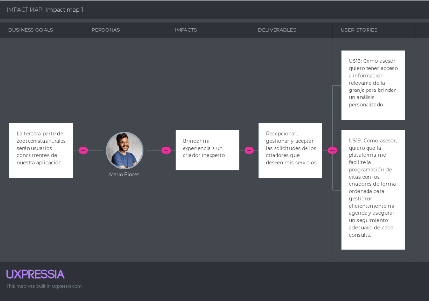
 
 _Imagen 17. impact map - asesor_

**Segmento: Criadores**

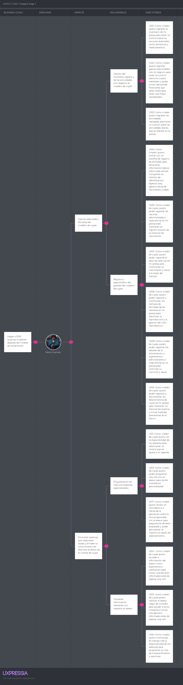
 
 _Imagen 18. impact map - criador_
 
 ## 3.4. Product Backlog

 Para trabajar el Product Backlog, se utilizó la herramienta Pivotal Tracker, la cual se encuentra en el siguiente enlace: <https://www.pivotaltracker.com/n/projects/2699734>

 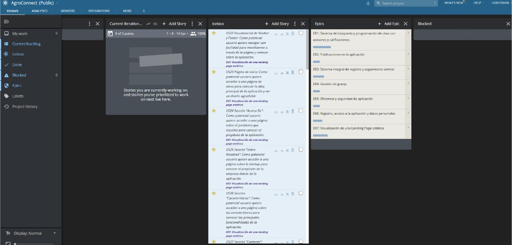

  _Imagen 19. product backlog_

|**# Orden**|**User Story Id**|**Título**|**Descripción**|**Story Points (1/2/3/5/8)**|
| :- | :- | :- | :- | :- |
|1|US22|Visualización de Navbar y Footer|**Como** potencial usuario **quiero** navegar con facilidad **para** movilizarme a través de la página y conocer sobre la aplicación.|2|
|2|US23|Página de inicio|**Como** potencial usuario **quiero** acceder a una página de inicio **para** conocer la idea principal de la aplicación y ver un diseño agradable.|1|
|3|US24|Sección “Acerca De”|**Como** potencial usuario **quiero** acceder a una página sobre el problema que resuelve **para** conocer el propósito de la aplicación.|2|
|4|US25|Sección “Sobre Nosotros”|**Como** potencial usuario **quiere** acceder a una página sobre la startup **para** conocer el propósito de la empresa detrás de la aplicación.|2|
|5|US26|Sección “Características”|**Como** potencial usuario **quiero** acceder a una página sobre las características **para** conocer las principales funcionalidades de la aplicación.|2|
|6|US27|Sección “Contacto”|**Como** potencial usuario **quiero** acceder a una página de contacto **para** poder contactar con la empresa en caso tenga algún problema, duda o sugerencia.|2|
|7|US01|Búsqueda de asesores|**Como** criador de cuyes **quiero** explorar asesores **para** recibir una mentoría.|5|
|8|US02|Información del asesor|**Como** criador de cuyes **quiero** tener acceso a la información del asesor **para** tomar una decisión informada antes de separar una cita.|3|
|9|US03|Visualización de horarios|**Como** criador de cuyes **quiero** ver la disponibilidad de los asesores **para** seleccionar un horario que se ajuste a mi agenda|3|
|10|US04|Programación de citas|**Como** criador de cuyes **quiero** poder programar una cita con un asesor **para** recibir orientación personalizada|8|
|11|US05|Información relevante previa cita|**Como** asesor **quiero** tener acceso al detalle de la cita **para** decidir si aceptar o no el trabajo.|5|
|12|US06|Notificación de citas al asesor|**Como asesor, quiero** recibir notificaciones de citas programadas por los criadores **para** mantenerme al tanto de mis ofertas laborales.|3|
|13|US07|Notificación de citas al criador de cuyes|**Como c**riador de cuyes **quiero** recibir notificaciones referentes al estado de mis citas **para** mantenerme al tanto de mi solicitud.|3|
|14|US08|Calificación del asesor|**Como** criador de cuyes **quiero** calificar al asesor luego de consulta **para** ayudar a otros criadores a tomar una decisión informada antes de separar una cita.|5|
|15|US09|Publicación del asesor|**Como** asesor **quiero** hacer publicaciones referentes a mis trabajos **para** que los criadores tengan más confianza en mí.|5|
|16|US10|Ver publicación de asesor|**Como** criador de cuyes **quiero** poder ver las publicaciones de la comunidad de asesores **para** obtener información útil y, si es necesario, solicitar asesoramiento en base a esas publicaciones.|5|
|17|US11|Registro de galpones de cuyes|**Como** criador de cuyes **quiero** poder registrar un galpón en la plataforma **para** poder almacenar y gestionar mis cuyes de manera efectiva, garantizando su seguridad y bienestar.|3|
|18|US12|Registro de animal|**Como** criador de cuyes **quiero** contar con un sistema de registro de animales **para** almacenar información básica sobre cada animal, incluyendo su número de identificación, especie, raza, género y fecha de nacimiento.|3|
|19|US13|Visualización y edición de información de animales|**Como** criador de cuyes **quiero** buscar a un animal en específico **para** visualizar o actualizar su información registrada.|8|
|20|US14|Registro de fallecimiento de cuyes|**Como** criador de cuyes **quiero** poder registrar y documentar los fallecimientos de cuyes en mi granja **para** tomar medidas.|2|
|21|US15|Gestión de recursos|**Como** criador de cuyes **quiero** registrar el inventario de mi granja **para** tener un control sobre los recursos esenciales como alimentos y medicamentos.|8|
|22|US16|Gestión de gastos realizados|**Como** criador de cuyes **quiero** registrar gastos relacionados con mi negocio **para** tener un control y poder tomar decisiones financieras que serán útiles para tener una mejor rentabilidad.|8|
|23|US17|Seguridad de información|**Como** criador/asesor **quiero** que la aplicación cumpla con los estándares de seguridad **para** proteger mi información registrada.|5|
|24|US18|Disponibilidad y confiabilidad|**Como** criador/asesor **quiero** que la aplicación esté disponible siempre **para** acceder a ella en cualquier momento y sin interrupciones.|3|
|25|US19|Registro de usuario|**Como** usuario **quiero** registrarme **para** acceder a las funciones de usuario.|3|
|26|US20|Inicio de sesión|**Como** usuario **quiero** acceder a mi cuenta registrada **para** acceder a las funciones de usuario.|3|
|27|US21|Recuperación de contraseña|**Como** usuario **quiero** poder recuperar mi contraseña **para** acceder a mi cuenta.|5|

# Capítulo IV: Product Design

## 4.1. Style Guidelines

### 4.1.1. General Style Guidelines

**Branding**

El logotipo de AgroConnect se presenta en forma de un círculo, que simboliza la unidad y la conexión dentro de las comunidades agrícolas peruanas. En el centro del círculo se encuentra un cuy, animal característico de las granjas peruanas y un símbolo de la agricultura local. El cuy está representado de manera amigable y sonriente, transmitiendo la naturaleza acogedora y cercana de la plataforma. El cuy lleva un pequeño gorro de granjero como un guiño a la laboriosa comunidad agrícola.

  

_Imagen 20. Logo de AgroConnect_

**Typography**

La tipografía elegida para AgroConnect es "Inter", una fuente sans-serif moderna y altamente legible. Este tipo de letra se destaca por su estilo limpio y contemporáneo, lo que comunica profesionalismo y actualización. La elección de Inter asegura que el texto en las interfaces de usuario sea fácilmente legible y tenga una apariencia moderna y uniforme. Además, Inter es una fuente versátil que ofrece una amplia variedad de pesos y estilos, lo que permite una adaptación flexible a diferentes contextos y tamaños de texto en la aplicación.

  

_Imagen 21. Variaciones de las fuentes a utilizar_

**Colors**

AgroConnect ha seleccionado una paleta de colores que comunica confiabilidad y eficiencia en la contratación de asesores especializados y en el uso de herramientas avanzadas. Los tonos predominantes, como los marrones, amarillos y anaranjados, transmiten una sensación cálida que evoca la calidez y la energía de la naturaleza presente en las granjas peruanas. Esta elección de colores no solo refleja la conexión con la tierra y las raíces agrícolas, sino que también sugiere un ambiente acogedor y estimulante para los usuarios de la plataforma.

**Spacing**

El spacing mantiene: 
 - Botones: padding de 16px vertical y 32px horizontal 
 - Margin entre texto 16px 
 - Margin entre elementos 24px 
 - Margin entre secciones 72px

### 4.1.2. Web Style Guidelines
(Revisar [Anexo N°3: Web Style Guidelines - Figma](#anexo-n°3-web-style-guidelines))

**Colors**

AgroConnect ha seleccionado cuidadosamente una paleta de colores que refleja los valores y la identidad de la plataforma. Los tonos elegidos comunican confiabilidad y eficiencia en la contratación de asesores especializados y en el uso de herramientas avanzadas.

  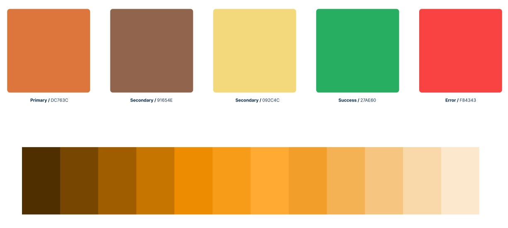

_Imagen 22. Colores a utilizar_

**Typography**

La tipografía desempeña un papel fundamental en la apariencia y la legibilidad de AgroConnect. Hemos seleccionado cuidadosamente la fuente "Inter", una fuente sans-serif moderna y altamente legible.

  

_Imagen 23. Tipografia a utilizar_

**Icons**

Los íconos desempeñan un papel importante en la experiencia del usuario al proporcionar una representación visual rápida y reconocible de diversas funciones y características dentro de AgroConnect. Hemos seleccionado una colección de íconos que son consistentes con la identidad visual de la plataforma y que refuerzan su propósito y temática agrícola.

  

_Imagen 24. Iconos a utilizar_

**Spacing**

El espaciado adecuado entre elementos es esencial para lograr una apariencia equilibrada y una experiencia de usuario cómoda en AgroConnect. Hemos establecido pautas claras de espaciado que garantizan coherencia y claridad en toda la plataforma.

  

_Imagen 25. Espaciado a utilizar_

**Grid System**

El grid system es una herramienta esencial en el diseño y la organización de la interfaz de usuario de AgroConnect. Proporciona una estructura visual que ayuda a distribuir y alinear los elementos de la página de manera consistente y armoniosa en diferentes tamaños de pantalla.

  

_Imagen 26. Grid System_

**Button**

Los botones son elementos importantes en la interfaz de usuario de AgroConnect, ya que proporcionan una forma clara y visualmente destacada para que los usuarios realicen acciones importantes. Hemos definido un estilo de botón consistente que refleja la identidad visual de la plataforma y promueve una experiencia de usuario intuitiva y coherente.

  

_Imagen 27. Buttons_

**Input System**

El input system es fundamental en la experiencia del usuario en AgroConnect, ya que proporciona formas para que los usuarios ingresen datos y realicen acciones dentro de la plataforma. Hemos definido un sistema de entrada consistente que garantiza una experiencia de usuario intuitiva y coherente en toda la interfaz.

  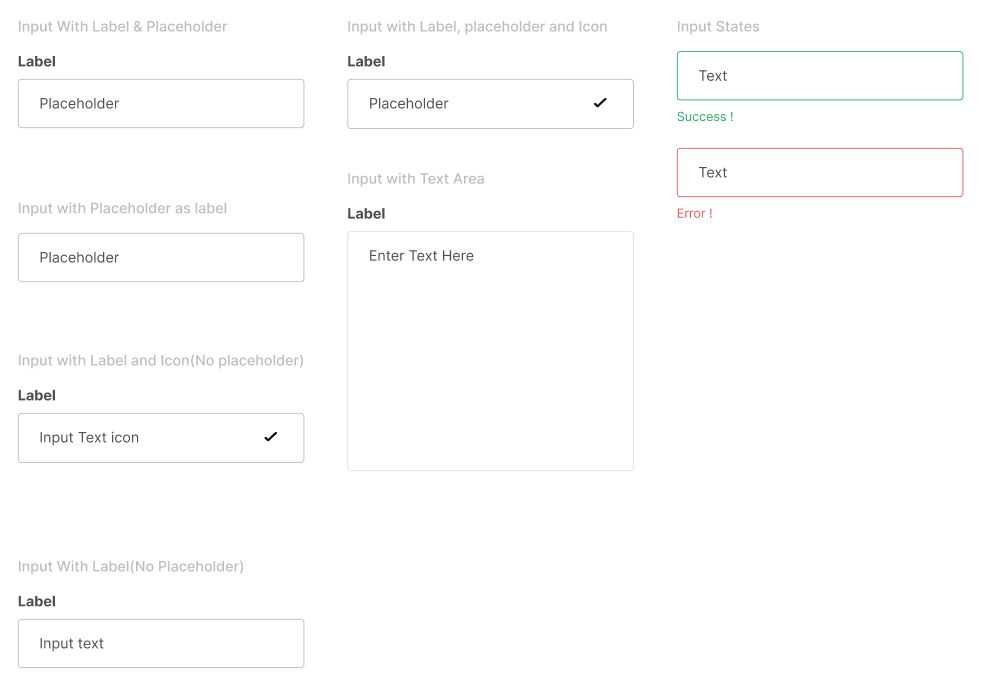

_Imagen 28. Input System_

## 4.2. Information Architecture

### 4.2.1. Organization Systems

En AgroConnect, aplicamos un sistema de jerarquía visual para resaltar la información esencial y relevante, garantizando que los usuarios encuentren fácilmente lo que necesitan. Utilizamos una organización secuencial para guiar intuitivamente a los usuarios a través del proceso de registro y búsqueda de asesores o asesoría. En lo que respecta a la categorización de contenido, está organizado según audiencia (Criadores y Asesores)

### 4.2.2. Labeling Systems

En el proyecto AgroConnect se eligió implementar un sistema de etiquetado breve y fácil de comprender para los usuarios. Las etiquetas que se utilizarán son las siguientes:

**Vista de Criador:**

<table>
  <tbody>
  <tr>
      <th>My Farm - Mi Granja</th>
      <td>Se implementará un botón que permitirá a los usuarios gestionar su inventario, que incluirá medicamentos, producción de carne, fertilizante y otros elementos relacionados.</td>
  </tr>
  <tr>
      <th>My Publications - Mis publicaciones</th>
      <td>Se implementará un botón que permitirá al usuario ver el historial de sus ofertas de trabajo.</td>
  </tr>
  <tr>
      <th>Advisors - Asesores</th>
      <td>Se implementará un botón que permitirá a los usuarios contactar con asesores.</td>
  </tr>
  <tr>
      <th>My animals - Mis animales</th>
      <td>Se implementará un botón que permitirá al usuario llevar un registro y seguimiento de los animales en la granja.</td>
  </tr>
  <tr>
      <th>Calendar - Calendario</th>
      <td>Se implementará un botón que permitirá visualizar un calendario con las tareas, eventos y actividades registradas.</td>
  </tr>
  <tr>
      <th>Notifications - Notificaciones</th>
      <td>Se implementará un botón que permitirá visualizar notificaciones respecto a las solicitudes de las ofertas de empleo.</td>
  </tr>
  <tr>
      <th>Logout</th>
      <td>Se implementará un botón que permitirá al usuario desvincularse de su cuenta.</td>
  </tr>
  </tbody>
</table>

  
**Vista de Asesor:**

<table>
  <tbody>
  <tr>
      <th>My Farm - Mi Granja</th>
      <td>Se implementará un botón que permitirá a los usuarios gestionar su inventario, que incluirá medicamentos, producción de carne, fertilizante y otros elementos relacionados.</td>
  </tr>
  <tr>
      <th>Publications - Publicaciones</th>
      <td>Se implementará un botón que permitirá al usuario ver las ofertas publicadas por los usuarios “Criadores”.</td>
  </tr>
  <tr>
      <th>My clients - Mis clientes</th>
      <td>Se implementará un botón que permitirá a los usuarios ver su clientes.</td>
  </tr>
  <tr>
      <th>My animals - Mis animales</th>
      <td>Se implementará un botón que permitirá al usuario llevar un registro y seguimiento de los animales en la granja.</td>
  </tr>
  <tr>
      <th>Calendar - Calendario</th>
      <td>Se implementará un botón que permitirá visualizar un calendario con las tareas, eventos y actividades registradas.</td>
  </tr>
  <tr>
      <th>Notifications - Notificaciones</th>
      <td>Se implementará un botón que permitirá visualizar notificaciones respecto a las solicitudes de las ofertas de empleo.</td>
  </tr>
  <tr>
      <th>Logout</th>
      <td>Se implementará un botón que permitirá al usuario desvincularse de su cuenta.</td>
  </tr>
</table>

### 4.2.3. SEO Tags and Meta Tags
### 4.2.4. Searching Systems

La aplicación AgroConnect desarrollará un sistema de búsqueda intuitivo, diseñado para que los usuarios encuentren rápidamente la información que necesitan. Este sistema se basará en filtros inteligentes que simplificarán la búsqueda de asesores, evitando así que los usuarios se vean abrumados por la cantidad de información disponible. Con esta mejora, nuestra aplicación garantizará una experiencia de usuario más fluida y satisfactoria al buscar información relevante.

<table>
  <tbody>
  <tr>
      <th>Ubicación</th>
      <td>Permite al usuario buscar asesores o recibir solicitudes de asesoramiento basadas en su ubicación actual o en una ubicación específica.</td>
  </tr>
  <tr>
      <th>Tipo de Asesoría</th>
      <td>Permite al usuario buscar según el tipo de asesoría ofrecida.</td>
  </tr>
  <tr>
      <th>Presupuesto</th>
      <td>Permite al usuario buscar asesores que se ajusten a su presupuesto.</td>
  </tr>
  <tr>
      <th>Experiencia</th>
      <td>Permite al usuario buscar asesores con un nivel de experiencia específico.</td>
  </tr>
  <tr>
      <th>Reputación</th>
      <td>Permite al usuario buscar asesores según las calificaciones obtenidas.</td>
  </tr>
  <tr>
      <th>Notifications - Notificaciones</th>
      <td>Se implementará un botón que permitirá visualizar notificaciones respecto a las solicitudes de las ofertas de empleo.</td>
  </tr>
  <tr>
      <th>Idioma</th>
      <td>Permite al usuario buscar según el idioma.</td>
  </tr>
  <tr>
      <th>Palabras Clave</th>
      <td>Proporciona un cuadro de búsqueda donde los usuarios pueden ingresar palabras clave específicas relacionadas con el tipo de asesoría que necesitan.</td>
  </tr>
  </tbody>
</table>

### 4.2.5. Navigation Systems

La página de inicio de AgroConnect ha sido diseñada para una experiencia fácil y completa, ofreciendo las siguientes características:

 - **Descargar la Aplicación:** AgroConnect brinda a los usuarios la posibilidad de descargar la aplicación móvil de manera destacada en la página de inicio. Esto les permite acceder a la plataforma de forma conveniente desde sus dispositivos móviles. Al hacer clic en "Descargar App", los usuarios pueden obtener fácilmente la aplicación.

 - **Escanear el Código QR:** Para una experiencia aún más rápida y práctica, los usuarios tienen la opción de escanear un código QR proporcionado en la plataforma. Esto los lleva directamente a la aplicación de AgroConnect.

 - **Iniciar Sesión / Registrarse:** En la landing page, los usuarios pueden optar por iniciar sesión si ya tienen una cuenta o registrarse si son nuevos en la plataforma. Estos botones les permiten acceder a sus cuentas existentes o crear nuevas cuentas para aprovechar todas las funciones de AgroConnect.

# Capítulo V Product Implementation, Validation & Deployment

## 5.1. Software Configuration Management.

### 5.1.1. Software Development Environment Configuration.

**Project Management:**

Para la gestión del proyecto, utilizamos como principal medio de comunicación WhatsApp, a través de un grupo en el cual compartimos nuestras ideas y opiniones sobre cada parte del trabajo. A esto se le suma el uso de la herramienta Google Meet, para realizar reuniones en videoconferencia y conversar de forma síncrona. Por otro lado, el proyecto también tiene que ser documentado con todos los puntos requeridos, por lo que utilizamos Google Drive para la creación de documentos compartidos y trabajar de forma colaborativa, permitiendo un mejor flujo de trabajo y tener un historial sobre lo que realizó cada uno. Asimismo, utilizamos GitHub para el manejo de repositorios a través de una comunidad conformada por todos los integrantes del equipo. En esta, también documentamos los reportes y la aplicación en sí.

**Requirements Management:**

Para el registro de los requisitos, o también llamadas historias de usuario, utilizamos la herramienta Pivotal Tracker, en la cual registramos cada una de ellas y ordenadas por prioridad según el Product Backlog. La realización de este fue grupal, todos los integrantes aportamos en las historias de usuario y discutimos sobre las principales funcionalidades que consideramos que debe tener la aplicación web.

**Product UX/UI Design:**

Se realizaron los productos de UX con la herramienta UXPressia, así como el User Persona, Empathy Mapping, Impact Mapping, entre otras. Gracias a esto pudimos modelar bien los diseños de la experiencia de usuario, lo cual nos sirve para poder ponernos en una mejor perspectiva para nuestros segmentos objetivo. Por otro lado, hicimos los prototipos de la aplicación web utilizando la herramienta Figma, la cual nos permitió crear los Wireframes y Mock-ups para tener un diseño previo al desarrollo de la aplicación.

**Software Development:**

Como principal IDE, utilizamos Visual Studio Code, el cual es el entorno de desarrollo con el que estamos más familiarizados, además que ofrece flexibilidad, facilidad de uso y una gran variedad de soporte de lenguajes de programación. Además, permite la conexión con repositorios en línea creados en GitHub, lo cual nos permite tener una mejor gestión del proyecto, así como el historial de todos los cambios realizados. En la otra mano, para el desarrollo usamos los lenguajes aprendidos previamente, como HTML, CSS y JavaScript, y nuevos conocimientos adquiridos este ciclo como el framework de AngularJS.

**Software Testing:**

Las pruebas de aceptación son importantes a realizar para comprobar que los criterios de aceptación planteados están favoreciendo a las necesidades del negocio y cumplir con los requerimientos, para lo cual utilizamos el lenguaje Gherkin. Este consiste en trabajar el escenario con Given When Then, y lograr identificar las variables de input y output, lo cual es sencillo de entender para todos ya que utiliza lenguaje natural. Gracias a este, es que se logra garantizar la calidad del software, por ello cumple un papel esencial en los proyectos de desarrollo.

### 5.1.2. Source Code Management.

Usuarios de GitHub
<table>
  <thead>
    <tr>
        <th>Integrante</th>
        <th>Usuario de GitHub</th>
    </tr>
  </thead>
  <tbody>
  <tr>
      <td>Delgado Corrales, Piero Gonzalo</td>
      <td>PieroD04</td>
  </tr>
  <tr>
      <td>Lucas Coronel, Nadia Alessandra</td>
      <td>nad21lc</td>
  </tr>
  <tr>
      <td>Paredes Puente, Sebastián Roberto</td>
      <td>sebastian123gonzalo</td>
  </tr>
  <tr>
      <td>Salinas Torres, Salvador Antonio</td>
      <td>salvadoorssalinas</td>
  </tr>
  <tr>
      <td>Valverde Mozo, Andre Gabriel</td>
      <td>AndreVMG</td>
  </tr>
  </tbody>
</table>

*URL de repositorio de Landing Page:* https://github.com/AgroTech-UPC/Landing-Page

*URL de repositorio de Web Services:* https://github.com/AgroTech-UPC/Web-Services

*URL de repositorio de Frontend Web Applications:* https://github.com/AgroTech-UPC/Frontend-Web-Applications

*URL de repositorio de Acceptance Tests*: https://github.com/AgroTech-UPC/Acceptance-Tests

Para el desarrollo del trabajo se hará uso de GitFlow, el cual es un modelo de flujo de trabajo para la gestión de control de versiones Git. Está compuesta por ramas y cada una cumple un propósito distinto: Main, Feature, Develop. En la rama Main, se trabaja con las versiones finales del sprint y se hace un despliegue de la aplicación web, por lo que se espera que todas las versiones almacenadas en esta rama sean funcionales y estables para el usuario. En las ramas Feature se trabaja con versiones sobre las que se desarrolla un feature específico, así como un feature para registro de un usuario o un feature para inicio de sesión. Las ramas Feature se trabajan y controlan por separado para tener un orden sobre el cual trabajar a partir del Product Backlog, y en caso ocurra algún problema al trabajar en un feature, no afecte sobre todo el programa. Finalmente, tenemos la rama Develop, sobre la cual se fusionan todos los features ya trabajados. De esta manera, se puede asegurar que todo esté funcionando como se espera antes de hacer el despliegue oficial para pasarlo a la rama Main.

### 5.1.3. Source Code Style Guide & Conventions.
En el desarrollo de este trabajo, se utilizará una gran variedad de lenguajes para trabajar en el Landing Page, Web Services y Frontend Web Application. Para ello, se utilizará la siguiente guía de estilos y convenciones.

**HTML**

Es el lenguaje utilizado para estructurar el contenido de una página web, brindando una variedad de elementos posibles como texto, imágenes, formularios, etc.
https://www.w3schools.com/html/html5_syntax.asp

- Declarar el tipo de documento en la primera línea con \<!DOCTYPE html>.
- Respetar la estructura básica del HTML: \<html>, \<head>, \<body>.
- Declarar el título de la página para dar a conocer al usuario en qué página se encuentra. (Usar el elemento \<title> en \<head>)
- Se usará la indentación coherente para lograr una lectura sencilla del código, por lo que es importante tener la tabulación correcta para cada nivel de anidamiento.
- Siempre cerrar los elementos que lo requieran, ya sea una división, párrafo, título. (Si se declara una \
, siempre cerrarlo con \
)
- Declarar el atributo “alt” para las imágenes.

**CSS**

Es el lenguaje utilizado para definir el diseño de la página web, así como los estilos, fuentes, colores, contenedores, etc.
https://google.github.io/styleguide/htmlcssguide.html
- Usar indentación de forma correcta.
- Los nombres para elementos deben ser cortos y en minúsculas.
- Declarar los colores en código hexadecimal. (Ejemplo: #024A86)
- Dejar comentarios para conocer el propósito del estilo y su uso.
- El diseño debe ser responsive para que los usuarios lo puedan visualizar cómodamente desde el dispositivo en qué se encuentren.

**JavaScript**

Es el lenguaje de programación más utilizado para la programación web, ya que permite desarrollar páginas interactivas con animaciones agradables para los usuarios.
https://www.w3schools.com/js/js_conventions.asp
- Declarar nombres coherentes y cortos para las variables y funciones.
- Dejar comentarios para dar a conocer que hace cada parte del código sobre la página web.
- Siempre colocar un punto y coma al final de cada línea de código.
- Declarar las constantes cuando sea necesario en lugar de variables que nunca cambiarán su valor.
- Usar los operadores de comparación estricta en lugar de comparación regular cuando sea posible. (Ejemplo: Utilizar === en lugar de ==)

**TypeScript**

Es el superjunto de JavaScript que añade características como el tipado estático y funciones avanzadas.
https://www.typescriptlang.org/docs/handbook/intro.html
- Declarar nombres significativos y consistentes para las variables, al igual que en JavaScript.
- Declarar interfaces y tipos en PascalCase.
- Declarar variables y funciones en CamelCase.
- Dejar comentarios para explicar sobre lo que hace cada parte del código.
- Usar interfaces para la reutilización de código.

**Java**

Es un lenguaje de programación utilizado para la programación web, programación móvil, entre otros. Es capaz de adaptarse para funcionar en distintas plataformas.
https://google.github.io/styleguide/javaguide.html
- Nombrar las variables, funciones y clases con CamelCase, además de ser significativos y cortos.
- Utilizar HTTPS para establecer una conexión segura.
- Usar indentación correctamente para un código coherente y ordenado.
- Usar comillas dobles (“) para las cadenas de texto.
- Dejar comentarios en cada bloque de código para explicar su funcionalidad.
- Declarar constantes cuando sean variables que no cambiarán su valor a lo largo de todo el código.

**Gherkin**

Es el lenguaje para el diseño de casos de prueba en base a los requisitos establecidos por el negocio. Este se utiliza durante el proceso de testing.
https://specflow.org/gherkin/gherkin-conventions-for-readable-specifications/
- Separar en bloques cada parte de Given When Then, para una mejor lectura y subdividirse adecuadamente.
- Al mostrar las variables de input y output con sus ejemplos, se utilizan tablas para la representación de estos. Sin embargo, no es necesario utilizar tantas tablas para cada parte del código, sino una general al final del escenario.
- Si hay más de un escenario en un archivo, hacer la separación adecuada entre estas para diferenciarlas y dar a conocer que son más de uno. Para ello, se puede dejar dos líneas en blanco para saber dónde es que un escenario termina y el otro comienza.
- Agregar líneas en blanco dentro de cada Step para una mejor lectura y organización de la información.

### 5.1.4. Software Deployment Configuration.

Para la configuración del despliegue de la aplicación, utilizaremos Git, un sistema de control de versiones distribuido que es bastante utilizado en proyectos de desarrollo de software. Es una herramienta esencial para trabajar colaborativamente y poder hacer el seguimiento de los cambios realizados por los miembros del grupo. Una de sus mejores ventajas es su capacidad para rastrear los cambios en los archivos de un proyecto a lo largo del tiempo. Con Git, es posible crear ramas, realizar cambios en ellas y fusionarlos eficientemente, permitiendo que varios desarrolladores trabajen en diferentes aspectos del proyecto simultáneamente sin interferencias.

Por otro lado, tenemos a GitHub, el cual es la plataforma para poder alojar repositorios de Git. Es uno de los servicios más utilizados por desarrolladores de forma mundial, ya que permite manejar repositorios públicos y privados para almacenar el código en la nube. A parte de ello, maneja el historial de los repositorios, permitiendo a los usuarios acceder a todas las versiones trabajadas, permitiendo que puedan retornar a una versión anterior en caso lo deseen. Ofrece otras herramientas que son muy útiles como los pull requests, los cuales son solicitudes de revisiones de una rama y luego poder fusionarla con otra rama.

Así es como con este, que cada miembro podrá trabajar de forma remota desde su IDE, teniendo una copia del repositorio Git a través del repositorio en línea almacenado en GitHub, así poder hacer commits para empujar los cambios que hayan realizado.

## 5.2. Landing Page, Services & Applications Implementation.

### 5.2.1. Sprint 1

### 5.2.1.1. Sprint Planning 1.

Se planeó el primer sprint a través de una reunión en Meet. Para ello, se hizo la siguiente tabla para registrar la información que se discutió.

|**Sprint #**|Sprint 1|
| :- | :- |
|**Sprint Planning Background**||
|Date|2024-04-01|
|Time|10: 00 PM|
|Location|Virtual (Google Meet)|
|Prepared by|Delgado Corrales, Piero Gonzalo|
|Attendees (to planning meeting)|
Delgado Corrales, Piero Gonzalo

Lucas Coronel, Nadia Alessandra

Paredes Puente, Sebastián Roberto

Salinas Torres, Salvador Antonio

Valverde Mozo, Andre Gabriel
|
|Sprint n - 1 Review Summary|No hubo sprint anterior|
|Sprint n - 1 Retrospective Summary|No hubo sprint anterior|
|**Sprint Goal & User Stories**||
|Sprint 1 Goal|Realizar el Landing Page|
|Sprint 1 Velocity|20|
|Sum of Story Points|20|

### 5.2.1.2. Sprint Backlog 1.

El objetivo de este primer sprint es la implementación del Landing Page estático. Además, se trabajó con una tabla en Trello para manejar los Work-Items de forma adecuada.

<https://trello.com/b/AtaOZblV/sprint-backlog-1> 

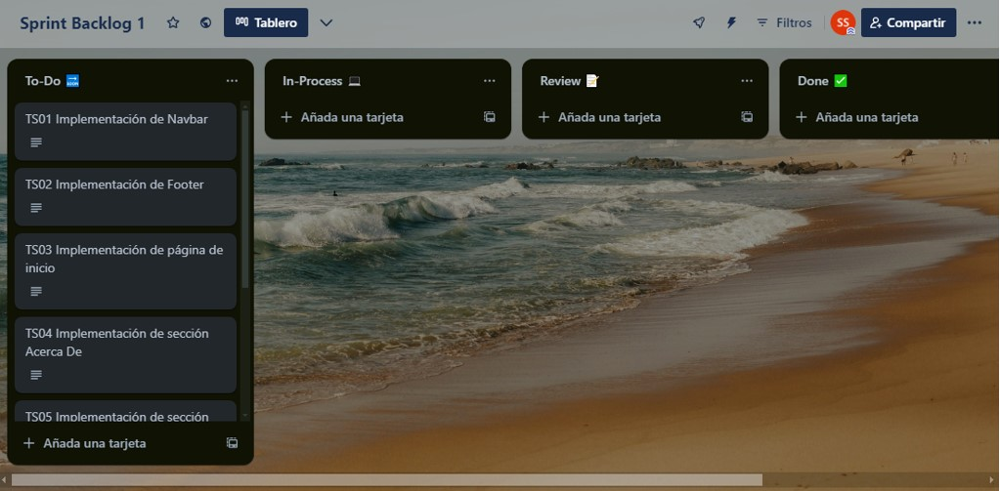 

<table><tr><th valign="top">Sprint #</th><th colspan="7" valign="top">Sprint 1</th></tr>
<tr><td colspan="2" valign="top">User Story</td><td colspan="6" valign="top">Work-Item / Task</td></tr>
<tr><td valign="top">Id</td><td valign="top">Title</td><td valign="top">Id</td><td valign="top">Title</td><td valign="top">Description</td><td valign="top">Estimation (Hours)</td><td valign="top">Assigned To</td><td valign="top">Status (To-Do / In-Process / Review / Done)</td></tr>
<tr><td rowspan="2" valign="top">US22</td><td rowspan="2" valign="top">Visualización de Navbar y Footer</td><td valign="top">TS01</td><td valign="top">Implementación de Navbar</td><td valign="top">Se implementa el navbar de forma responsive.</td><td valign="top">3</td><td valign="top">Nadia Lucas</td><td valign="top">Done</td></tr>
<tr><td valign="top">TS02</td><td valign="top">Implementación de Footer</td><td valign="top">Se implementa el footer de forma responsive.</td><td valign="top">1</td><td valign="top">Nadia Lucas</td><td valign="top">Done</td></tr>
<tr><td valign="top">US23</td><td valign="top">Página de inicio</td><td valign="top">TS03</td><td valign="top">Implementación de página de inicio</td><td valign="top">Se implementa la página de inicio de forma responsive y con su archivo css correspondiente.</td><td valign="top">1</td><td valign="top">Nadia Lucas</td><td valign="top">Done</td></tr>
<tr><td valign="top">US24</td><td valign="top">Sección “Acerca De”</td><td valign="top">TS04</td><td valign="top">Implementación de sección Acerca De</td><td valign="top">Se implementa la página Acerca De, de forma responsive y con su archivo css correspondiente.</td><td valign="top">2</td><td valign="top">Sebastián Paredes</td><td valign="top">Done</td></tr>
<tr><td valign="top">US25</td><td valign="top">Sección “Sobre Nosotros”</td><td valign="top">TS05</td><td valign="top">Implementación de sección Sobre Nosotros</td><td valign="top">Se implementa la página Sobre Nosotros, de forma responsive y con su archivo css correspondiente.</td><td valign="top">2</td><td valign="top">Salvador Salinas</td><td valign="top">Done</td></tr>
<tr><td valign="top">US26</td><td valign="top">Sección “Características”</td><td valign="top">TS06</td><td valign="top">Implementación de sección Características</td><td valign="top">Se implementa la página Características, de forma responsive y con su archivo css correspondiente.</td><td valign="top">2</td><td valign="top">Andre Valverde</td><td valign="top">Done</td></tr>
<tr><td valign="top">US27</td><td valign="top">Sección “Contacto”</td><td valign="top">TS07</td><td valign="top">Implementación de sección Contacto</td><td valign="top">Se implementa la página Contacto, de forma responsive y con su archivo css correspondiente.</td><td valign="top">2</td><td valign="top">Piero Delgado</td><td valign="top">Done</td></tr>
</table>

### 5.2.1.3. Development Evidence for Sprint Review.

Se realizaron los avances con los commits correspondiente en el repositorio de la siguiente forma.

|**Repository**|**Branch**|**Commit Id**|**Commit Message**|**Commited on (Date)**|
| :- | :- | :- | :- | :- |
|AgroTech-UPC/Landing-Page|feature/header-footer|ff5467f|feat: Preparing the workspace|02/04/2024|
|AgroTech-UPC/Landing-Page|feature/header-footer|965448b|feat: Complete header and footer|02/04/2024|
|AgroTech-UPC/Landing-Page|develop|f450025|Merge pull request #1 from AgroTech-UPC/header-footer|02/04/2024|
|AgroTech-UPC/Landing-Page|develop|bab8888|refactor: login button deleted & padding to main|02/04/2024|
|AgroTech-UPC/Landing-Page|feature/contact|1fdfcb2|feat: contact page completed|03/04/2024|
|AgroTech-UPC/Landing-Page|feature/contact|2a79c52|fix: fixed position of footer|03/04/2024|
|AgroTech-UPC/Landing-Page|develop|1c1cab7|Merge pull request #4 from AgroTech-UPC/feature/contact|03/04/2024|
|AgroTech-UPC/Landing-Page|feature/home|12c2b0b|feat: home page completed|03/04/2024|
|AgroTech-UPC/Landing-Page|develop|b348cf3|Merge pull request #5 from AgroTech-UPC/feature/home|03/04/2024|
|AgroTech-UPC/Landing-Page|feature/about-us|bcee2f1|feat: about us section added|03/04/2024|
|AgroTech-UPC/Landing-Page|develop|f0b57ab|Merge pull request #7 from AgroTech-UPC/feature/about-us|03/04/2024|
|AgroTech-UPC/Landing-Page|feature/about-app|a0f235c|Feat: Section about-app created|04/04/2024|
|AgroTech-UPC/Landing-Page|feature/characteristics|2c15c6d|feat: features section added|04/04/2024|
|AgroTech-UPC/Landing-Page|develop|961b6fe|Merge pull request #8 from AgroTech-UPC/feature/about-app|04/04/2024|
|AgroTech-UPC/Landing-Page|develop|bc8aa23|Merge pull request #10 from AgroTech-UPC/feature/characteristics|04/04/2024|
|AgroTech-UPC/Landing-Page|main|341ad78|Merge pull request #11 from AgroTech-UPC/develop|04/04/2024|

### 5.2.1.4. Testing Suite Evidence for Sprint Review.

Se realizaron las pruebas de aceptación para las historias de usuario trabajadas utilizando el lenguaje Gherkin en archivos feature. De esta manera, se registraron en el repositorio.

|**Repository**|**Branch**|**Commit Id**|**Commit Message**|**Commited on (Date)**|
| :- | :- | :- | :- | :- |
|AgroTech-UPC/Acceptance-Tests|main|57f2c58|feat: added feature file for US29|05/04/2024|
|AgroTech-UPC/Acceptance-Tests|main|1b94680|feat: added feature file for US28|05/04/2024|
|AgroTech-UPC/Acceptance-Tests|main|9027b2b|Fix: fix typing error|05/04/2024|
|AgroTech-UPC/Acceptance-Tests|main|329c774|feat: added acceptance test for US31|05/04/2024|
|AgroTech-UPC/Acceptance-Tests|main|24c738a|feat: added acceptance test for US30|06/04/2024|
|AgroTech-UPC/Acceptance-Tests|main|802f736|feat: added acceptance test for US26|07/04/2024|
|AgroTech-UPC/Acceptance-Tests|main|29d85ed|feat: added acceptance test for US27|07/04/2024|

### 5.2.1.5. Execution Evidence for Sprint Review.

En esta sección, se mostrará lo avanzado en el primer sprint, el cual se basa en la implementación del Landing Page estático. Para ello, se realizó el siguiente video con la explicación y las capturas que evidencia la página web.

**URL de video:** <https://youtu.be/Yi3p53UjKF0>

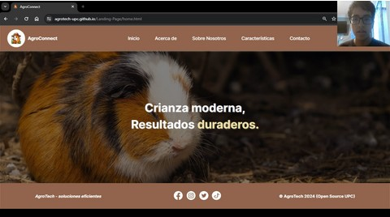 

_Imagen 29. evidencia landing page 1_

Navbar: fue implementada para que sea responsive y las secciones pasen a un menú lateral en caso de ser necesario.

 

_Imagen 30. navbar 1_

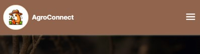 

_Imagen 31. navbar 2_

Footer: al igual que el navbar, se implementó para acomodarse acorde al tamaño de la ventana.

 

_Imagen 32. footer 1_

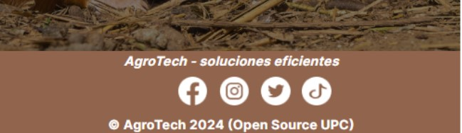 

_Imagen 33. footer 2_

Página de inicio:

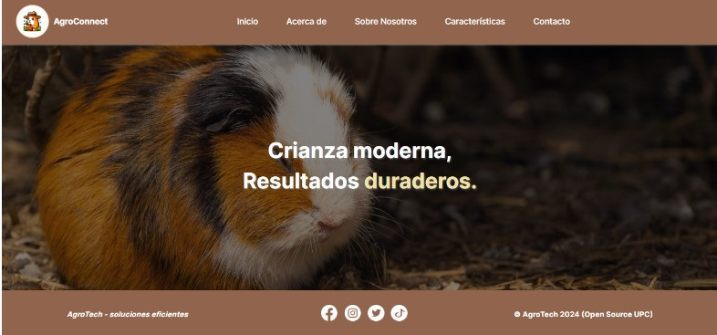 

_Imagen 34. pagina de inicio 1_

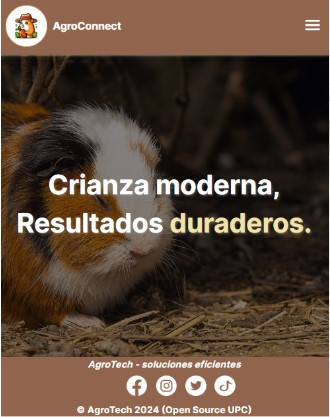 

_Imagen 35. pagina de inicio 2_

Sección “Acerca De”:

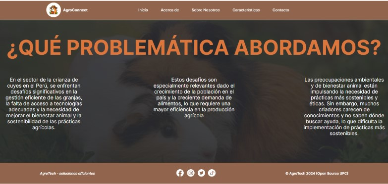 

_Imagen 36. seccion "Acerca de" 1_

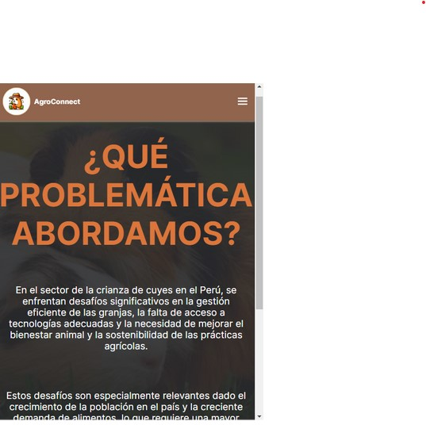 

_Imagen 37. seccion "Acerca de" 2_

Sección “Sobre Nosotros”:

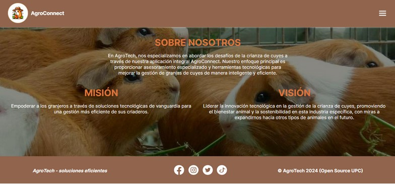 

_Imagen 38. seccion "Sobre Nosotros" 1_

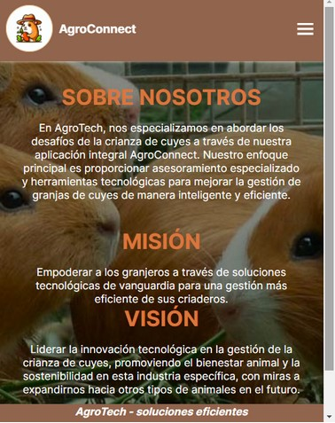

_Imagen 39. seccion "Sobre Nosotros" 2_

Sección “Características”: 

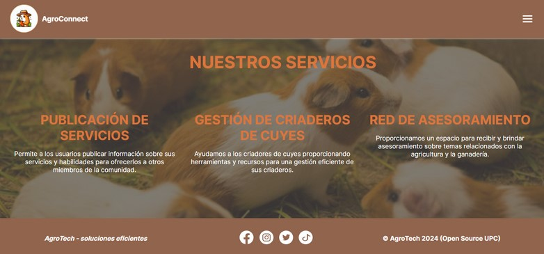 

_Imagen 40. seccion "Caracteristicas" 1_

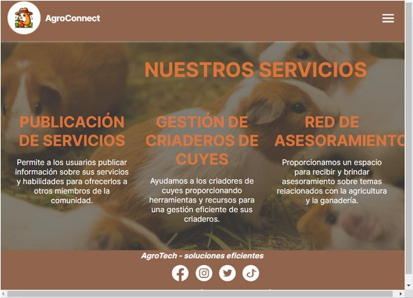 

_Imagen 41. seccion "Caracteristicas" 2_

Sección “Contacto”:

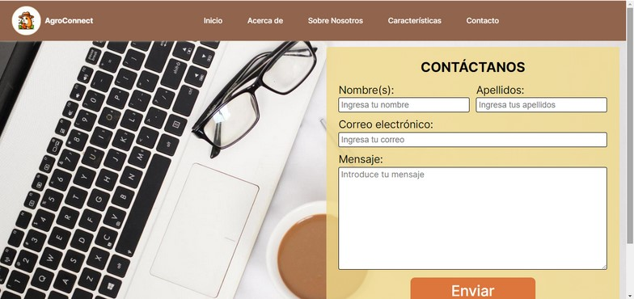 

_Imagen 42. seccion "Contacto" 1_

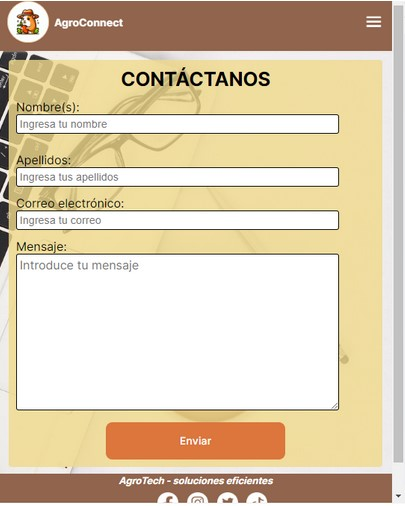 

_Imagen 43. seccion "Contacto" 2_

### 5.2.1.6. Execution Evidence for Sprint Review.

En este primer sprint, no hemos trabajado con servicios web, ya que nos hemos concentrado exclusivamente en la creación del Landing Page estático. Es por ello que en esta ocasión, no se trabajó la documentación relacionada con el uso de servicios web.

### 5.2.1.7. Execution Evidence for Sprint Review.

Una vez acabamos de trabajar con todas las historias de usuario, realizamos el deployment del Landing Page utilizando GitHub Pages.

URL de deployment de Landing Page: <https://agrotech-upc.github.io/Landing-Page/home.html>

Para lograr hacer el deployment, entramos a la configuración del repositorio y a la sección de Pages. Luego, debemos seleccionar la rama sobre la cual se hará el deployment.

 

_Imagen 44. github - pages - 1_

Escogimos la rama main, ya que es la rama principal sobre la cual se guarda la versión final para hacer el deployment. Una vez se escoge, se guardan los cambios.

 

_Imagen 45. github - pages - 2_

Finalmente, solo se espera a que GitHub cree la página y nos brinde el enlace.

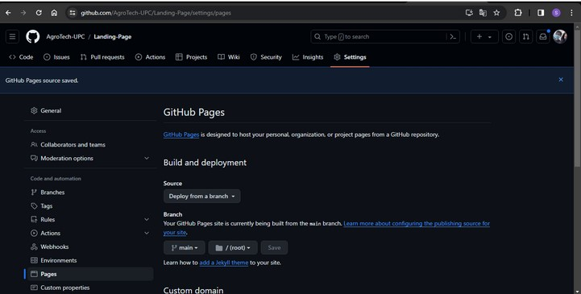 

_Imagen 46. github - pages - 3_

 

_Imagen 47. github - pages - 4_

### 5.2.1.8. Team Collaboration Insights during Sprint.

En la elaboración de la landing page, todos los integrantes realizaron commits referentes al branch feature que les tocó trabajar. 

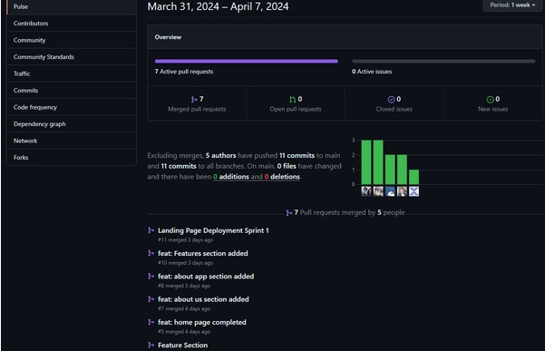 

_Imagen 48. commits - landing-page_

La división de trabajo para lograr la implementación fue por secciones en las cuales cada miembro realizó una sección de la landing page:

-Piero Delgado: sección ‘contacto’

-Sebastían Paredes: sección ‘acerca de’

-Nadia Lucas: sección ‘inicio’

-André Valverde: sección ‘características’

-Salvador Salinas: sección ‘sobre nosotros’

Cada sección tuvo su rama con el formato ‘feature/sección’

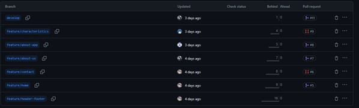

_Imagen 49. feature-seccion_

# Bibliografía

hdeleon.net. (2019, May 2). ¿Cómo hacer una base de datos de Usuarios con Roles de acceso? | SQL Server [Video]. YouTube. https://www.youtube.com/watch?v=Xrbl6Xgmi-Q 

Luque, R. (2023). Meta Tags | Las 7 más importantes en SEO. SEOcrawl. https://seocrawl.com/meta-tags/

Me, K. (2016). GALPON PARA CRIANZA DE CUYES 1. Nombres de la Tecnología: Galpón para Crianza de Cuyes 2. Campo de Aplicación de la Tecnología: Nivel productivo. www.academia.edu. https://www.academia.edu/27131568/GALPON_PARA_CRIANZA_DE_CUYES_1_Nombres_de_la_Tecnolog%C3%ADa_Galp%C3%B3n_para_Crianza_de_Cuyes_2_Campo_de_Aplicaci%C3%B3n_de_la_Tecnolog%C3%ADa_Nivel_productivo 

Ministerio de Desarrollo Agrario y Riego (2023) Cadena productiva de cuyes. https://cdn.www.gob.pe/uploads/document/file/4061856/Cadena%20productiva%20de%20cuy.pdf

SENASA. (2019). Cajamarca es el principal productor de cuy en el Perú. Recuperado de https://www.senasa.gob.pe/senasacontigo/cajamarca-es-el-principal-productor-de-cuy-en-el-peru/

Ministerio de Desarrollo Agrario y Riego. (2023). Cadena Productiva de Cuy. Recuperado de https://cdn.www.gob.pe/uploads/document/file/4061856/Cadena%20productiva%20de%20cuy.pdf. 

# Anexos

## Anexo N°1: Gráfico de evolución de población de cuyes

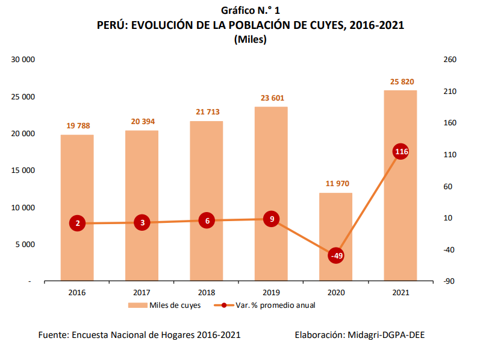

_Imagen 50. grafico - anexo_

Recuperado de: https://cdn.www.gob.pe/uploads/document/file/4061856/Cadena%20productiva%20de%20cuy.pdf

## Anexo N°2: Diagrama de problemas en la crianza de cuyes

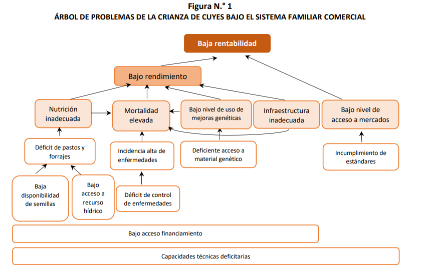

_Imagen 51. cuadro - anexo_

## Anexo N°3: Web Style Guidelines

https://www.figma.com/file/y65W2Fnk2IreDIFC3yPTAl/Open--Web-Style-Guidelines?type=design&node-id=0%3A1&mode=design&t=wpjgQEwVQwYdQHGP-1 