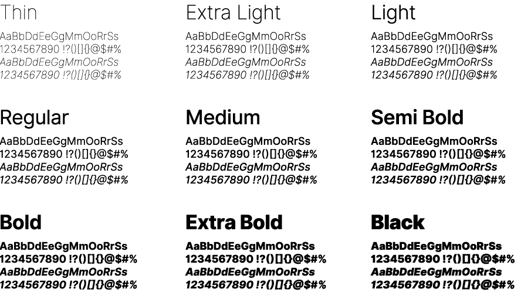
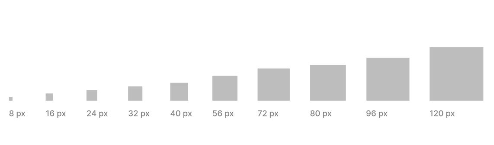
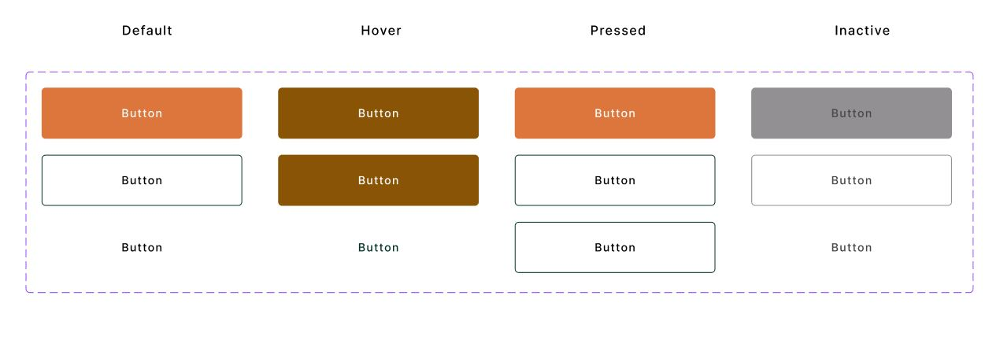

# **Universidad Peruana de Ciencias Aplicadas**
# Carrera de Ingeniería de Software

## Ciclo: 2024 - 1

## Curso: Desarrollo de Aplicaciones Open Source

## Sección: WX52

## Profesor: Elio Jefferrson Navarrete Vilca

### “Informe de Trabajo Final”

### Startup: AgroTech

### Producto: AgroConnect

### Grupo: 1

|          Integrantes          |      Código      |
|:-----------------------------:|:-------------------:|
|   Delgado Corrales, Piero Gonzalo   |    U202210749    |
|  Lucas Coronel, Nadia Alessandra   |    U202120430    |
|   Paredes Puente, Sebastián Roberto  |    U202217239    |
|  Salinas Torres, Salvador Antonio   |    U20221B127    |
|   Valverde Mozo, Andre Gabriel   |    U202218899    |

### Abril 2024 

### **Registro de Versiones**

---

| Versión | Fecha                | Autor                                                                                                                                                                                   | Descripción de modificación                                                                                                                             |
| ------- | -------------------- | --------------------------------------------------------------------------------------------------------------------------------------------------------------------------------------- | -------------------------------------------------------------------------------------------------------------------------------------------------------- |
| TB1     | Sábado 8 de Setiembre | - Delgado Corrales, Piero Gonzalo   - Lucas Coronel, Nadia Alessandra  - Paredes Puente, Sebastián Roberto   - Salinas Torres, Salvador Antonio   - Valverde Mozo, Andre Gabriel | Se han incluido los capítulos:  - Capítulo I: Introducción  - Capítulo II: Requirements Elicitation & Analysis,  - Capítulo III: Requirements Specification  - Capítulo IV: Product Design  Avance del Capítulo V: Product Implementation, Validation & Deployment hasta el punto 5.2.1.8  Avance de Conclusiones, Bibliografía y Anexos |

### **Project Report Collaboration Insights**
URL Project Report (Github): https://github.com/AgroTech-UPC/Project-Report

### **Tabla de Contenido**

- [Registro de Versiones](#registro-versiones)
- [Student Outcome](#student-outcome)
- [Capítulo I: Introducción](#Capítulo-I:-Introducción)
  - [1.1. Startup Profile](#11-startup-profile)
    - [1.1.1. Descripción de la Startup](#111-descripción-de-la-startup)
    - [1.1.2. Perfiles de integrantes del equipo](#112-perfiles-de-integrantes-del-equipo)
  - [1.2. Solution Profile](#12-solution-profile)
    - [1.2.1. Antecedentes y problemática](#121-antecedentes-y-problemática)
    - [1.2.2. Lean UX Process](#122-lean-ux-process)
      - [1.2.2.1. Lean UX Problem Statements](#1221-lean-ux-problem-statements)
      - [1.2.2.2. Lean UX Assumptions](#1222-lean-ux-assumptions)
      - [1.2.2.3. Lean UX Hypothesis Statements](#1223-lean-ux-hypothesis-statements)
      - [1.2.2.4. Lean UX Canvas](#1224-lean-ux-canvas)
  - [1.3. Segmentos objetivo](#13-segmentos-objetivo)
- [Capítulo II: Requirements Elicitation & Analysis](#Capítulo-II:-Requirements-Elicitation-&-Analysis)
  - [2.1. Competidores](#21-competidores)
    - [2.1.1. Análisis competitivo](#211-análisis-competitivo)
    - [2.1.2. Estrategias y tácticas frente a competidores](#212-estrategias-y-tácticas-frente-a-competidores)
  - [2.2. Entrevistas](#22-entrevistas)
    - [2.2.1. Diseño de entrevistas](#221-diseño-de-entrevistas)
    - [2.2.2. Registro de entrevistas](#222-registro-de-entrevistas)
    - [2.2.3. Análisis de entrevistas](#223-análisis-de-entrevistas)
  - [2.3. Needfinding](#23-needfinding)
    - [2.3.1. User Personas](#231-user-personas)
    - [2.3.2. User Task Matrix](#232-user-task-matrix)
    - [2.3.3. User Journey Mapping](#233-user-journey-mapping)
    - [2.3.4. Empathy Mapping](#234-empathy-mapping)
    - [2.3.5. As-is Scenario Mapping](#235-as-is-scenario-mapping)
  - [2.4. Ubiquitous Language](#23-ubiquitous-language)
- [Capítulo III: Requirements Specification](#Capítulo-III:-Requirements-Specification)
  - [3.1. To-Be Scenario Mapping](#31-to-be-scenario-mapping)
  - [3.2. User Stories](#32-user-stories)
  - [3.3. Impact Mapping](#33-impact-mapping)
  - [3.4. Product Backlog](#34-product-backlog)
- [Capítulo IV: Product Design](#Capítulo-IV:-Product-Design)
  - [4.1. Style Guidelines](#41-style-guidelines)
    - [4.1.1. General Style Guidelines](#411-general-style-guidelines)
    - [4.1.2. Web Style Guidelines](#412-web-style-guidelines)
  - [4.2. Information Architecture](#42-information-architecture)
    - [4.2.1. Organization Systems](#421-organization-systems)
    - [4.2.2. Labeling Systems](#422-labeling-systems)
    - [4.2.3. SEO Tags and Meta Tags](#423-seo-tags-and-meta-tags)
    - [4.2.4. Searching Systems](#424-searching-systems)
    - [4.2.5. Navigation Systems](#425-navigation-systems)
  - [4.3. Landing Page UI Design](#43-landing-page-ui-design)
    - [4.3.1. Landing Page Wireframe](#431-landing-page-wireframe)
    - [4.3.2. Landing Page Mock-up](#432-landing-page-mock-up)
  - [4.4. Web Applications UX/UI Design](#44-web-applications-uxui-design)
    - [4.4.1. Web Applications Wireframes](#441-web-applications-wireframes)
    - [4.4.2. Web Applications Wireflow Diagrams](#442-web-applications-wireflow-diagrams)
    - [4.4.3. Web Applications Mock-ups](#443-web-applications-mock-ups)
    - [4.4.4. Web Applications User Flow Diagrams](#444-web-applications-user-flow-diagrams)
  - [4.5. Web Applications Prototyping](#45-web-applications-prototyping)
  - [4.6. Domain-Driven Software Architecture](#46-domain-driven-software-architecture)
    - [4.6.1. Software Architecture Context Diagram](#461-software-architecture-context-diagram)
    - [4.6.2. Software Architecture Container Diagrams](#462-software-architecture-container-diagrams)
    - [4.6.3. Software Architecture Components Diagrams](#463-software-architecture-components-diagrams)
  - [4.7. Software Object-Oriented Design](#47-software-object-oriented-design)
    - [4.7.1. Class Diagrams](#471-class-diagrams)
    - [4.7.2. Class Dictionary](#472-class-dictionary)
  - [4.8. Database Design](#48-database-design)
    - [4.8.1. Database Diagram](#481-database-diagram)
- [Capítulo V: Product Implementation, Validation & Deployment](#Capítulo-V:-Product-Implementation,-Validation-&-Deployment)
  - [5.1. Software Configuration Management](#51-software-configuration-management)
    - [5.1.1. Software Development Environment Configuration](#511-software-development-environment-configuration)
    - [5.1.2. Source Code Management](#512-source-code-management)
    - [5.1.3. Source Code Style Guide & Conventions](#513-source-code-style-guide--conventions)
    - [5.1.4. Software Deployment Configuration](#514-software-deployment-configuration)
  - [5.2. Landing Page, Services & Applications Implementation](#52-landing-page-services--applications-implementation)
    - [5.2.1. Sprint n](#521-sprint-n)
      - [5.2.1.1. Sprint Planning n](#5211-sprint-planning-n)
       -[5.2.1.2. Sprint Backlog n](#5212-sprint-backlog-n)
      - [5.2.1.3. Development Evidence for Sprint Review](#5213-development-evidence-for-sprint-review)
      - [5.2.1.4. Testing Suite Evidence for Sprint Review](#5214-testing-suite-evidence-for-sprint-review)
      - [5.2.1.5. Execution Evidence for Sprint Review](#5215-execution-evidence-for-sprint-review)
      - [5.2.1.6. Services Documentation Evidence for Sprint Review](#5216-services-documentation-evidence-for-sprint-review)
      - [5.2.1.7. Software Deployment Evidence for Sprint Review](#5217-software-deployment-evidence-for-sprint-review)
      - [5.2.1.8. Team Collaboration Insights during Sprint](#5218-team-collaboration-insights-during-sprint)
  - [5.3. Validation Interviews](#53-validation-interviews)
    - [5.3.1. Diseño de Entrevistas](#531-diseño-de-entrevistas)
    - [5.3.2. Registro de Entrevistas](#532-registro-de-entrevistas)
    - [5.3.3. Evaluaciones según heurísticas](#533-evaluaciones-según-heurísticas)
  - [5.4. Video About-the-Product](#54-video-about-the-product)
- [Conclusiones](#conclusiones)
  - [Conclusiones y recomendaciones](#conclusiones-y-recomendaciones)
- [Video About-the-Team](#video-about-the-team)
- [Bibliografía](#bibliografía)
- [Anexos](#anexos)

# Capítulo IV: Product Design

## 4.1. Style Guidelines

### 4.1.1. General Style Guidelines

**Branding**

El logotipo de AgroConnect se presenta en forma de un círculo, que simboliza la unidad y la conexión dentro de las comunidades agrícolas peruanas. En el centro del círculo se encuentra un cuy, animal característico de las granjas peruanas y un símbolo de la agricultura local. El cuy está representado de manera amigable y sonriente, transmitiendo la naturaleza acogedora y cercana de la plataforma. El cuy lleva un pequeño gorro de granjero como un guiño a la laboriosa comunidad agrícola.

  

**Typography**

La tipografía elegida para AgroConnect es "Inter", una fuente sans-serif moderna y altamente legible. Este tipo de letra se destaca por su estilo limpio y contemporáneo, lo que comunica profesionalismo y actualización. La elección de Inter asegura que el texto en las interfaces de usuario sea fácilmente legible y tenga una apariencia moderna y uniforme. Además, Inter es una fuente versátil que ofrece una amplia variedad de pesos y estilos, lo que permite una adaptación flexible a diferentes contextos y tamaños de texto en la aplicación.

  

**Colors**

AgroConnect ha seleccionado una paleta de colores que comunica confiabilidad y eficiencia en la contratación de asesores especializados y en el uso de herramientas avanzadas. Los tonos predominantes, como los marrones, amarillos y anaranjados, transmiten una sensación cálida que evoca la calidez y la energía de la naturaleza presente en las granjas peruanas. Esta elección de colores no solo refleja la conexión con la tierra y las raíces agrícolas, sino que también sugiere un ambiente acogedor y estimulante para los usuarios de la plataforma.

**Spacing**

El spacing mantiene: 
 - Botones: padding de 16px vertical y 32px horizontal 
 - Margin entre texto 16px 
 - Margin entre elementos 24px 
 - Margin entre secciones 72px

### 4.1.2. Web Style Guidelines
 [Ver Anexo N°1]

**Colors**

AgroConnect ha seleccionado cuidadosamente una paleta de colores que refleja los valores y la identidad de la plataforma. Los tonos elegidos comunican confiabilidad y eficiencia en la contratación de asesores especializados y en el uso de herramientas avanzadas.

  

**Typography**

La tipografía desempeña un papel fundamental en la apariencia y la legibilidad de AgroConnect. Hemos seleccionado cuidadosamente la fuente "Inter", una fuente sans-serif moderna y altamente legible.

  

**Icons**

Los íconos desempeñan un papel importante en la experiencia del usuario al proporcionar una representación visual rápida y reconocible de diversas funciones y características dentro de AgroConnect. Hemos seleccionado una colección de íconos que son consistentes con la identidad visual de la plataforma y que refuerzan su propósito y temática agrícola.

  

**Spacing**

El espaciado adecuado entre elementos es esencial para lograr una apariencia equilibrada y una experiencia de usuario cómoda en AgroConnect. Hemos establecido pautas claras de espaciado que garantizan coherencia y claridad en toda la plataforma.

  

**Grid System**

El grid system es una herramienta esencial en el diseño y la organización de la interfaz de usuario de AgroConnect. Proporciona una estructura visual que ayuda a distribuir y alinear los elementos de la página de manera consistente y armoniosa en diferentes tamaños de pantalla.

  

**Button**

Los botones son elementos importantes en la interfaz de usuario de AgroConnect, ya que proporcionan una forma clara y visualmente destacada para que los usuarios realicen acciones importantes. Hemos definido un estilo de botón consistente que refleja la identidad visual de la plataforma y promueve una experiencia de usuario intuitiva y coherente.

  

**Input System**

El input system es fundamental en la experiencia del usuario en AgroConnect, ya que proporciona formas para que los usuarios ingresen datos y realicen acciones dentro de la plataforma. Hemos definido un sistema de entrada consistente que garantiza una experiencia de usuario intuitiva y coherente en toda la interfaz.

  

## 4.2. Information Architecture

### 4.2.1. Organization Systems

En AgroConnect, aplicamos un sistema de jerarquía visual para resaltar la información esencial y relevante, garantizando que los usuarios encuentren fácilmente lo que necesitan. Utilizamos una organización secuencial para guiar intuitivamente a los usuarios a través del proceso de registro y búsqueda de asesores o asesoría. En lo que respecta a la categorización de contenido, está organizado según audiencia (Criadores y Asesores)

### 4.2.2. Labeling Systems

En el proyecto AgroConnect se eligió implementar un sistema de etiquetado breve y fácil de comprender para los usuarios. Las etiquetas que se utilizarán son las siguientes:

**Vista de Criador:**

<table>
  <tbody>
  <tr>
      <th>My Farm - Mi Granja</th>
      <td>Se implementará un botón que permitirá a los usuarios gestionar su inventario, que incluirá medicamentos, producción de carne, fertilizante y otros elementos relacionados.</td>
  </tr>
  <tr>
      <th>My Publications - Mis publicaciones</th>
      <td>Se implementará un botón que permitirá al usuario ver el historial de sus ofertas de trabajo.</td>
  </tr>
  <tr>
      <th>Advisors - Asesores</th>
      <td>Se implementará un botón que permitirá a los usuarios contactar con asesores.</td>
  </tr>
  <tr>
      <th>My animals - Mis animales</th>
      <td>Se implementará un botón que permitirá al usuario llevar un registro y seguimiento de los animales en la granja.</td>
  </tr>
  <tr>
      <th>Calendar - Calendario</th>
      <td>Se implementará un botón que permitirá visualizar un calendario con las tareas, eventos y actividades registradas.</td>
  </tr>
  <tr>
      <th>Notifications - Notificaciones</th>
      <td>Se implementará un botón que permitirá visualizar notificaciones respecto a las solicitudes de las ofertas de empleo.</td>
  </tr>
  <tr>
      <th>Logout</th>
      <td>Se implementará un botón que permitirá al usuario desvincularse de su cuenta.</td>
  </tr>
  </tbody>
</table>

  
**Vista de Asesor:**

<table>
  <tbody>
  <tr>
      <th>My Farm - Mi Granja</th>
      <td>Se implementará un botón que permitirá a los usuarios gestionar su inventario, que incluirá medicamentos, producción de carne, fertilizante y otros elementos relacionados.</td>
  </tr>
  <tr>
      <th>Publications - Publicaciones</th>
      <td>Se implementará un botón que permitirá al usuario ver las ofertas publicadas por los usuarios “Criadores”.</td>
  </tr>
  <tr>
      <th>My clients - Mis clientes</th>
      <td>Se implementará un botón que permitirá a los usuarios ver su clientes.</td>
  </tr>
  <tr>
      <th>My animals - Mis animales</th>
      <td>Se implementará un botón que permitirá al usuario llevar un registro y seguimiento de los animales en la granja.</td>
  </tr>
  <tr>
      <th>Calendar - Calendario</th>
      <td>Se implementará un botón que permitirá visualizar un calendario con las tareas, eventos y actividades registradas.</td>
  </tr>
  <tr>
      <th>Notifications - Notificaciones</th>
      <td>Se implementará un botón que permitirá visualizar notificaciones respecto a las solicitudes de las ofertas de empleo.</td>
  </tr>
  <tr>
      <th>Logout</th>
      <td>Se implementará un botón que permitirá al usuario desvincularse de su cuenta.</td>
  </tr>
  </tbody>
</table>

### 4.2.3. SEO Tags and Meta Tags
### 4.2.4. Searching Systems
### 4.2.5. Navigation Systems

